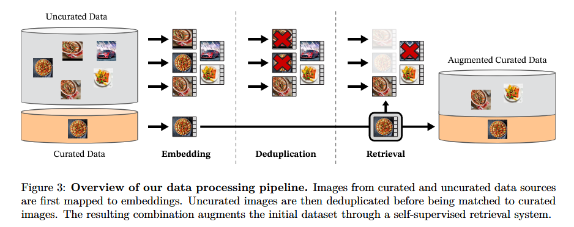
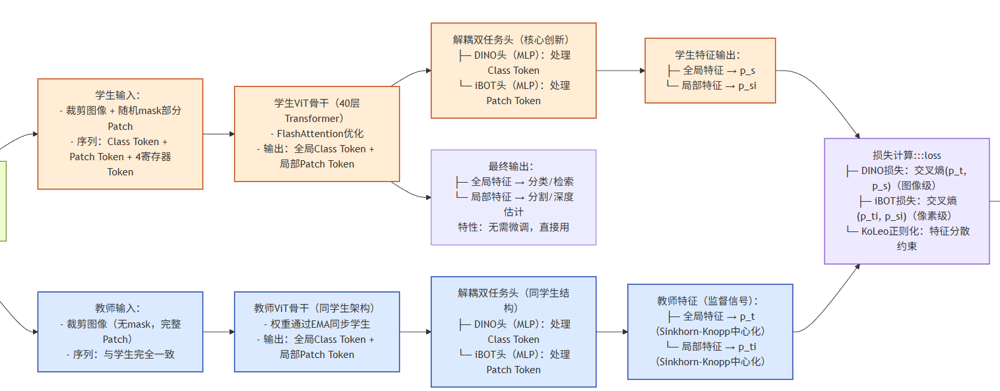
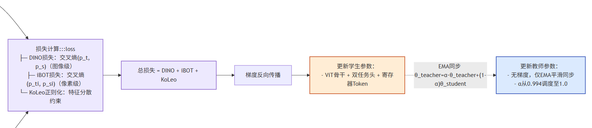
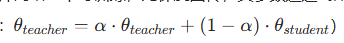
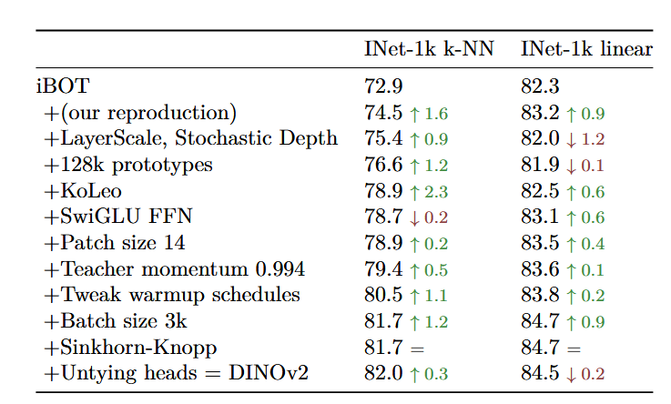
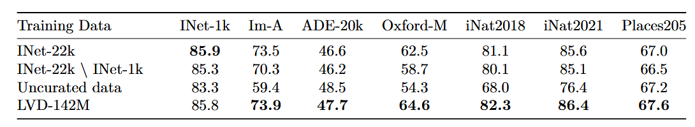
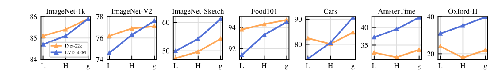
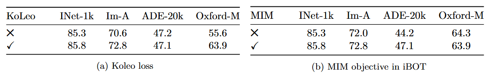
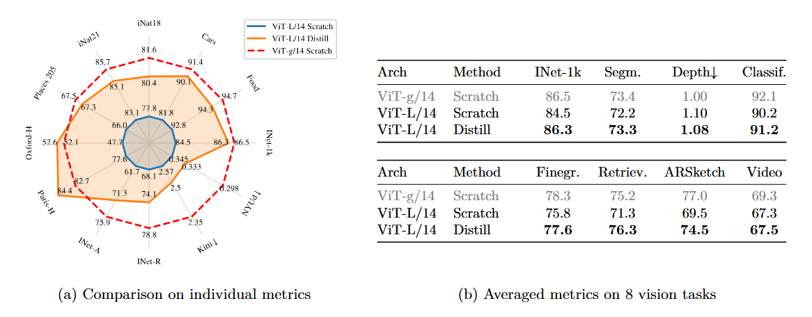
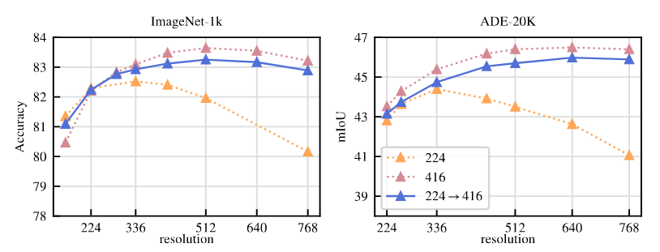

# [论文解读]DINOv2: Learning Robust Visual Features without Supervision​
论文地址：<https://arxiv.org/abs/2304.07193>   
核心作者：Maxime Oquab等  
领域：计算机视觉-自监督学习  
关键词：无监督视觉预训练；通用视觉特征；Vision Transformer；数据精选；模型蒸馏；高效训练

# 论文核心价值
1. 数据层面：提出自动精选数据流水线，构建 LVD-142M 高质量数据集，无需文本 / 人工标注；
2. 训练层面：融合图像级 + 像素级双损失，新增正则化与优化策略，解决双任务冲突；
3. 模型层面：提出大模型蒸馏方案，让中小模型复用大模型能力，平衡性能与成本；

# 1.研究背景
## 1.1两大局限  
    - 文本引导预训练（如 CLIP、OpenCLIP）：依赖图像 - 文本对齐数据，图像描述仅能近似图像信息，丢失像素级细粒度结构（如物体边缘、空间关系），且灵活性不足（无法仅用图像数据训练）
    - 自监督学习（如 DINO、iBOT）：要么依赖小体量精选数据（如 ImageNet-1k，120 万张），泛化性有限；要么使用无精选海量数据，特征质量大幅下降，难以适配跨分布、跨任务场景。
## 1.2如何不依赖文本监督或人工标注，仅通过自监督学习，利用图像数据训练出 “开箱即用” 的通用视觉特征？

## 1.3当前的自监督：
   - 图像内自监督训练：  
     - 核心思路：基于单张图像设计 pretext 任务（如图像上色、拼图、掩码重建），让模型学习特征；  
     - 代表方法：MAE（掩码自编码器）、Context Prediction（上下文预测）；
     - 核心缺陷：学到的特征需后续有监督微调才能适配下游任务，无法实现引言要求的 “开箱即用”。
   - 判别式自监督学习
     - 核心思路：通过图像间或图像组间的判别信号学习特征（如对比学习、聚类）；  
     - 代表方法：DINO（图像级对比）、iBOT（补丁级掩码预测）；
     - 核心缺陷：难以缩放至大模型规模（如1B参数以上），且未同时兼顾图像级全局特征和像素级局部特征，跨任务适配能力弱。
   - 自监督缩放研究  
     - 核心思路：扩大数据规模或模型参数，提升自监督特征性能；
     - 代表方法：SEERv2（10B 图像训练）、Goyal et al. (2022a)；
     - 核心缺陷：依赖无精选数据，导致特征泛化性差，需微调才能生效，呼应引言中 “无精选数据质量不足” 的痛点。

# 2.数据处理  
  
## 2.1数据来源：双轨输入  
   1. 精选数据（Curated Data）：
        - 核心构成：包含 ImageNet-22k（1400 万张）、ImageNet-1k 训练集（128 万张）、Google Landmarks（谷歌地标数据集）及多个细粒度数据集（如 CUB-200 鸟类、FGVC-Aircraft 飞机、Food-101 等），覆盖分类、分割、深度估计等多类下游任务场景。
      
   2. 无精选数据（Uncurated Data）：
      - 来源：从公开网络爬取数据仓库中提取，通过解析网页标签获取图像 URL。

## 2.2去重  
如图所示的第三步：
1. 自去重（针对无精选数据）：
  - 方法：采用 Pizzi 等人（2022）的复制检测流水线，对 12 亿张无精选图像计算特征嵌入，通过余弦相似度检索每张图像的 64 个最近邻，将相似度 > 0.6 的图像归为 “近重复簇”，每个簇仅保留 1 张代表性图像。
  - 效果：将无精选数据从 12 亿压缩至 11 亿张，大幅减少冗余，提升数据多样性（避免模型反复学习同一类图像特征）。
2. 相对去重（针对所有数据）：
  - 目的：避免训练数据与下游评估基准的测试集 / 验证集重复，确保实验结果的公正性（若训练数据包含测试集图像，会导致性能虚高）。
  - 方法：采用与自去重类似的逻辑，但设置更严格的相似度阈值（>0.45），剔除与所有评估基准（如 ImageNet-1k、ADE20k 等）测试 / 验证集相似的图像。
  - 效果：最终得到 744M 张 “无内部冗余、无评估集重叠” 的高质量无精选数据。
    
## 2.3自监督图像检索
以精选数据为锚点，从无精选数据中检索高质量相似图像，如图的第四步，扩大数据集规模：
1. 前置准备：
   - 特征提取：用一个在 ImageNet-22k 上预训练的自监督 ViT-H/16 模型，为所有精选数据和去重后的无精选数据计算图像嵌入；
   - 距离度量：采用余弦相似度衡量图像间的视觉相似性（避免欧氏距离对特征尺度的敏感问题）。
2. 效果：最终得到 744M 张 “无内部冗余、无评估集重叠” 的高质量无精选数据。
3. 两种检索策略
4. 样本级检索（Sample-based Retrieval）—— 针对大规模精选数据集（如 ImageNet-22k、Google Landmarks）：
   - 逻辑：对每张精选数据图像，从无精选数据中检索 N 个最近邻图像，直接扩展数据集规模。
   - 参数选择：N=4（论文通过实验验证：N 过大会导致 “多查询检索同一图像” 的冲突，N=4 能在规模扩展与多样性之间达到最佳平衡）。
   - 效果：ImageNet-22k 通过该策略从 1400 万扩展至 5600 万张，Google Landmarks 从 158 万扩展至 632 万张。
5. [聚类级检索](#聚类级检索)（Cluster-based Retrieval）—— 针对小规模细粒度数据集（如 CUB-200、Flowers-102）：
   - 逻辑：先对 744M 无精选数据做 k-means 聚类（聚为 10 万个簇，每个簇对应一类视觉概念）；对每张细粒度精选图像，找到其所属簇，从簇中采样 M 张图像（确保覆盖同类视觉概念）。
   - 限制条件：每个细粒度数据集的检索结果上限为 100 万张，避免单一数据集主导整个训练集，保证数据多样性。
   - 效果：如 CUB-200（仅 5994 张训练图）通过该策略扩展至 100 万张，既保留细粒度特征，又提升数据规模。

# 3.判别式自监督预训练

核心目标解决相关工作中“判别式自监督学习无法同时兼顾图像级全局特征与像素级局部特征”“大模型训练易震荡、难缩放” 的缺陷。  
解决方案：“图像级 + 像素级” 双任务协同的判别式自监督训练框架

整体架构图
## 输入：

## 主体：
  

1. 这是整个训练的基础架构，延续了 DINO 和 iBOT 的核心逻辑，但做了优化适配大模型训练，核心思想：用 “学生网络” 主动学习特征，“教师网络” 提供稳定的监督信号，避免训练震荡（自监督学习中无标签，需通过该架构构建监督信号）；
2. 解耦任务头 
   1. 背景：前代方法（如 iBOT）中，DINO 损失和 iBOT 损失共享同一个 MLP 任务头，导致大模型训练时 “全局特征与局部特征梯度冲突”（一个任务的梯度会干扰另一个任务），训练不稳定；
   2. 改进：为 DINO 损失和 iBOT 损失设计两个独立的 MLP 任务头，各自优化，互不干扰；
   3. 核心价值：解决双任务优化冲突，让大模型（如 ViT-g）能稳定同时学好全局和局部特征，这是 DINOv2 在像素级任务上超越前代方法的关键。
3. Sinkhorn-Knopp 中心化

   1. 背景：传统 DINO/iBOT 中，教师网络的输出仅通过简单移动平均中心化，大批量训练时分布易波动，导致监督信号不稳定；  
   2. 改进：用 Sinkhorn-Knopp 算法（迭代 3 次）对教师网络的输出分布做 “批归一化”，强制分布均匀且稳定；
   3. 核心价值：让教师网络的监督信号更平滑、更可靠，避免学生网络训练震荡，提升特征质量。
4. KoLeo 正则化

    1. 核心思想：鼓励同一批次内的特征向量 “均匀分布”，避免特征聚类塌陷（即多个不同图像的特征挤在一起，失去区分度）；
    2. 计算方式
       - 对批次内的特征向量做ℓ2 归一化； 
       - 计算每个特征向量与批次内其他所有特征向量的最小距离  dn,i =minj=i ∥xi −xj ∥
       - 损失函数：LKoLeo =−n1 ∑i=1n log(dn,i ) （n为批次大小），通过最小化该损失，让特征向量在空间中分散；
    3. 核心作用：提升特征的区分度，尤其对图像检索等依赖特征相似度的任务帮助极大（论文 ablation 显示，加入后 Oxford-M 检索 mAP 提升 8%+）。
5. 高分辨率适配

    1. 背景：低分辨率训练（224×224）会导致小物体或精细结构的特征丢失，影响分割、深度估计等像素级任务性能；但全程高分辨率训练（如 518×518）会大幅增加计算成本和内存占用；
    2. 改进：采用 “后期短时间适配” 策略 —— 前期 99% 的训练在 224×224 分辨率下进行，最后 10k 迭代（约 1.6% 的训练步数）将分辨率提升至 518×518，继续训练；
    3. 核心价值：以极低的计算成本，大幅提升像素级任务性能，效果接近全程高分辨率训练（实验验证：mIoU 提升 3%+），兼顾效率与性能。

## 反向梯度：

- 参数更新规则：学生网络：可训练，所有参数（ViT 骨干、任务头、寄存器 Token）通过反向传播更新；
    - 教师网络：不可训练，无梯度回传，其参数通过 “指数移动平均（EMA）” 同步学生网络的参数（更新公式）：
    - α 为 EMA 系数（论文中采用余弦调度从 0.994 递增到 1.0，越训练教师参数越稳定）；
关键作用：教师网络的输出是 “平滑后的高质量特征”，作为学生网络的监督目标，避免学生被数据中的噪声干扰，提升特征泛化性。
- “双损失并行优化”，同时覆盖全局和局部特征，两个损失共享 ViT 骨干网络，但通过解耦头独立计算：
    1. 图像级目标：DINO 损失
       1. 输入：学生和教师网络对 “同一图像的不同裁剪版本”（大裁剪 224×224、小裁剪 98×98）提取的 Class Token（全局特征载体）；
       2. 计算流程：  
        
          1. 学生网络的 Class Token 输入 “DINO 任务头”（独立 MLP），输出 “原型分数向量”，经 softmax 得到学生预测分布 ps 
          2. 教师网络的 Class Token 输入 “教师 DINO 任务头”（独立 MLP），输出原型分数向量，经 softmax+Sinkhorn-Knopp 中心化（后续会讲）得到教师监督分布 pt 
          3. 损失函数：交叉熵损失，让学生分布逼近教师分布，公式为  LDINO =−∑pt logps 
          4. 核心作用：优化图像级全局特征的区分度，让模型能识别 “图像整体属于哪类”（如 “猫”“汽车”），支撑分类、检索等任务。  
       
    2. 像素级目标：iBOT 损失 

        1. 输入：学生网络接收 “掩码后” 的图像 Patch Token（随机掩盖部分 Patch），教师网络接收 “无掩码” 的完整 Patch Token；
        2. 计算流程：
     
             1. 学生网络的 “掩码 Patch 对应的 Token” 输入 “iBOT 任务头”（独立 MLP），输出掩码位置的预测分数，经 softmax 得到 psi 
             2. 教师网络的 “对应位置未掩码 Patch Token” 输入 “教师 iBOT 任务头”（独立 MLP），输出监督分数，经 softmax+Sinkhorn-Knopp 中心化得到 pti 
             3. 损失函数：交叉熵损失，让学生准确预测掩码位置的特征，公式为  LiBOT =−∑i pti logpsi （i为掩码 Patch 的索引）； 
             4. 核心作用：优化像素级局部特征的精细度，让模型能捕捉 “图像局部是什么结构”（如 “猫的耳朵”“汽车的轮子”），支撑分割、深度估计等任务。

# 4.消融实验

## 整体性能对比 
“双损失 + 优化设计”（如 LayerScale、KoLeo 正则化、解耦头）相比原始 iBOT，哪些组件能提升性能，以及提升幅度。  

- KoLeo 正则化是 k-NN 性能提升最大的组件（+2.3%），证明 “特征分散” 对全局特征区分度的关键作用；
- 增大批次（3k）和调整训练策略（warmup、动量） 共同推动性能提升，验证 “训练稳定性” 的重要性；
- 解耦头虽让线性探针性能微降（↓0.2%），但保证了 k-NN 性能峰值，且支撑后续大模型缩放

## 数据差异对比

- 精选数据碾压无精选数据—— 无精选数据在跨域任务（Im-A、iNat2021）和检索任务（Oxford-M）上性能暴跌（↓8%-14%），证明 “数据质量比单纯规模重要”；  

- 两条曲线： ①蓝色（LVD-142M）； ②橙色（ImageNet-22k，14M）
- 关键现象：模型规模越小（如 ViT-S），两条曲线差距越小；模型规模越大（如 ViT-g），蓝色曲线越领先（如 INet-1k、Cars 任务领先 3%-5%）。
- 大模型（ViT-g）只有搭配大规模精选数据（LVD-142M）才能发挥性能，单独放大模型或数据效果有限。

## 损失对比
KoLeo 正则化、iBOT 掩码损失（MIM）的必要性，以及对不同任务的影响。

- KoLeo 正则化是检索任务的 “关键增益项”——Oxford-M 检索 mAP 提升 8.3%，对分类任务（INet-1k）影响较小（↑0.5%），印证其 “分散特征分布” 的设计目标（检索依赖特征相似度区分）；
- iBOT 掩码损失（MIM）是像素级任务的 “核心支撑”——ADE-20k 分割 mIoU 提升 2.9%，对检索任务无影响，证明其 “强化局部像素特征” 的作用（分割依赖局部结构识别）；
- 双组件互补 ——KoLeo 优化全局特征区分度，MIM 优化局部特征精细度，共同支撑 DINOv2 的 “多任务适配” 能力。

## 知识蒸馏可能 “过滤大模型的噪声特征”
  
蒸馏模型在部分任务（如检索）甚至超越教师模型，证明蒸馏过程可能 “过滤大模型的噪声特征”，实现 “去芜存菁”。

## 精度影响 
  
“后期短时间高分辨率适配（224→416）” 相比 “全程固定分辨率” 的效果，平衡性能与计算成本。

# 问题

1. DINOv2 构建 LVD-142M 数据集时，针对大规模精选数据集和小规模细粒度数据集分别采用了样本级检索和聚类级检索两种策略。请说明：为什么小规模细粒度数据集不能直接使用样本级检索？聚类级检索是如何兼顾 “数据规模扩展” 和 “类别纯度” 的？
2. 解耦双任务头是 DINOv2 支撑大模型训练的核心结构创新，相比前代方法的共享任务头，它在大模型（如 ViT-g）训练中解决了什么核心问题？结合消融实验结果，该设计对应的性能表现有什么特点？
3. 模型蒸馏是 DINOv2 实现 “大模型能力下沉” 的关键手段。为什么蒸馏后的 ViT-L 在图像检索任务上的性能提升最为显著？蒸馏过程中 “移除掩码和随机深度” 的操作有什么作用？

# 知识点
1. <a id="聚类级检索">聚类级检索</a>
   - 场景：你只有 10 张 “特定品种鸟类” 的图（细粒度数据），想找更多同类图，但直接在 10 亿张图里搜 “相似图”，可能只找到 20 张，数量不够；
   - 聚类第一步：先把 10 亿张无精选图分成 10 万个 “筐”（簇），每个筐里的图都是视觉上相似的（比如 “带翅膀的小动物”“红色羽毛的鸟” 等视觉概念）；
   - 聚类第二步：先确定你的 10 张鸟类图属于哪个 / 哪些筐，再从这些筐里挑 100 万张图 —— 既保证挑到的都是 “鸟类相关”（类别纯度），又能快速扩充到足够规模，解决 “细粒度数据样本少、直接检索无效” 的问题。

   