# [论文解读]Visual Instruction Tuning
论文地址：<https://arxiv.org/abs/2304.08485>   
核心作者：Haotian Liu等  
领域：计算机视觉-自监督学习  
关键词：无监督视觉预训练；通用视觉特征；Vision Transformer

# 论文核心价值
1. 多模态指令遵循数据：提出基于 ChatGPT/GPT-4 的 pipeline，将图像 - 文本对转化为指令遵循格式数据。 
2. 大型多模态模型（LLaVA）：连接 CLIP 视觉编码器与 Vicuna 语言解码器，端到端微调生成数据。 
3. 评估基准（LLaVA-Bench）：构建两个含图像、指令、标注的挑战性基准。 

# 1.研究背景
## 1.1问题
 - 缺乏高质量视觉 - 语言指令遵循数据集 
 - 缺乏通用型多模态指令遵循模型 
## 1.2研究目标
将文本领域的指令调优扩展到语言 - 图像多模态空间，构建通用视觉助手。

## 1.3相关工作
1. 多模态指令遵循代理 
    - 端到端训练模型：针对特定任务设计（如视觉 - 语言导航、图像编辑），无法适配多任务通用场景。
    - 系统协调模型：通过 LangChain/LLM 协调多个模型（如 Visual ChatGPT），非端到端训练，灵活性和效率受限。
    - 本文定位：聚焦开发 “端到端训练的多任务语言 - 视觉多模态模型”，弥补现有方案的通用性缺陷。
2. 指令调优 
    - NLP 领域：指令调优能显著提升 LLM 的零样本 / 少样本泛化能力（如 InstructGPT、FLAN-T5），技术成熟。
    - 多模态领域：现有模型（如 Flamingo、BLIP-2、OpenFlamingo）仅基于图像 - 文本对训练，未用视觉 - 语言指令数据调优，多模态任务性能弱于文本任务。
    - 关键区分：本文的 “视觉指令调优” 不同于 “视觉提示调优”—— 前者聚焦提升指令遵循能力，后者聚焦模型适配的参数效率。

# 2.数据
## 2.1关键前提
GPT-4 是纯文本模型，无法直接处理图像，因此需要先将图像 “转化为文本可理解的形式”—— 即 “符号化表示”，让 GPT-4 能基于这些文本间接 “感知” 图像内容。  
- 核心思路： 
  1. 图像符号化表示 → GPT-4 上下文学习生成指令数据 → 构建多样化指令样本库
  2. 生成字幕（Captions）：从多个角度描述图像场景（如 “人们在地下停车场给 SUV 装行李”）；
  3. 边界框（Boxes）：标注图像中物体的类别和空间坐标（如 “person: [0.681, 0.242, 0.774, 0.694]”），明确物体位置和属性。
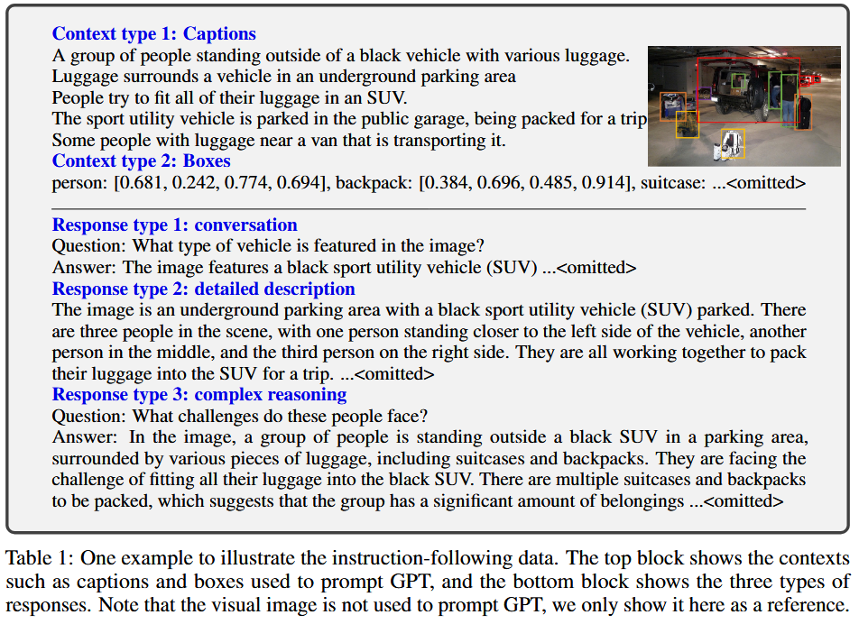

## 2.2生成三种类型数据
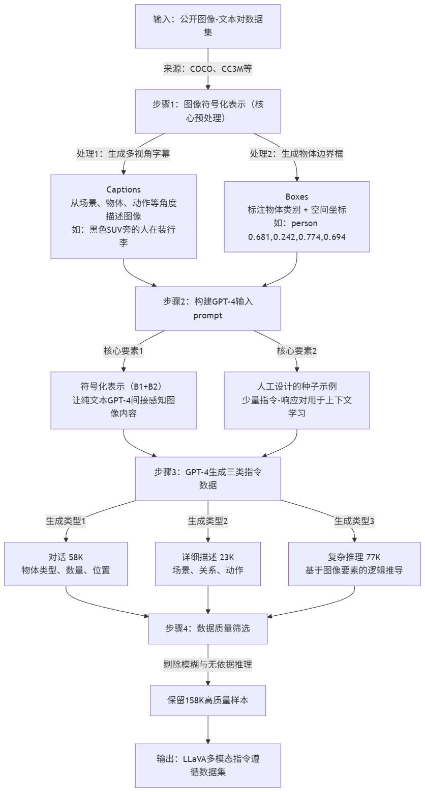
为覆盖不同交互场景和推理深度，生成三类数据，每类都通过 “人工设计种子示例→GPT-4 上下文学习” 生成，确保质量。
1. 类型 1：对话（Conversation，58K 样本）：
    - 设计多轮问答对话，问题聚焦图像视觉内容（物体类型、数量、动作、位置、相对关系等），仅包含有明确答案的问题（能从图像中确定存在或不存在）。
2. 类型 2：详细描述（Detailed description，23K 样本）：
    - 生成要求模型全面、细致描述图像的指令，比如 “详细描述这张图像的所有元素”，GPT-4 基于符号化表示生成包含场景、物体、位置、动作的完整描述。
3. 类型 3：复杂推理（Complex reasoning，77K 样本）：
    - 基于图像内容设计需要逻辑推理的问题，答案需包含分步推理过程。
    - 示例：问 “这些人面临什么挑战？”→ 答 “行李数量多，需要高效摆放以适配 SUV 空间，同时不能影响驾驶视野和乘客舒适度”。

# 3.模型结构和训练
## 3.1模型结构
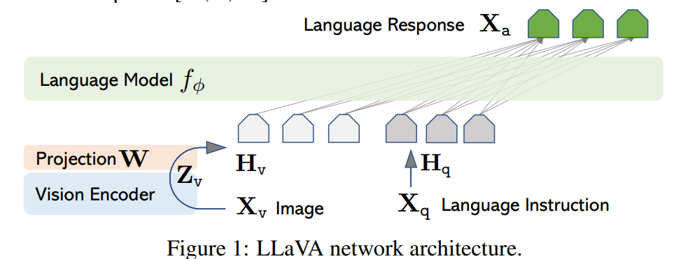

1. 视觉编码器（g(Xv)） 
   - 选型：CLIP 的 ViT-L/14 预训练模型。
   - 核心作用：提取图像的视觉特征Zv（实验中同时考虑最后一层 Transformer 前后的网格特征）。
   - 选型理由：CLIP 是开源且泛化能力强的视觉 - 语言预训练模型，其视觉编码器能有效捕捉图像的通用特征，适配开放场景的视觉理解。

2. 投影层（W） 
    - 核心作用：将视觉特征Zv（维度与语言嵌入空间不同）通过线性变换，转化为与 LLM 词嵌入空间维度一致的视觉 tokensHv。
    - 关键设计：仅用简单线性层（而非复杂跨注意力 / 门控机制），轻量化且便于快速迭代数据相关实验。

3. 语言模型（fφ(Xq, Hv)） 
    - 选型：Vicuna（基于 LLaMA 的指令调优模型）。
    - 核心作用：接收 “语言指令Xq+ 视觉 tokensHv” 的联合输入，通过自回归生成遵循指令的语言响应Xa。
    - 选型理由：Vicuna 在公开 LLM 中指令遵循能力最优，能直接复用其文本指令理解能力，降低多模态指令调优的复杂度。

## 3.2训练策略
1. 训练数据格式（统一多模态指令序列）

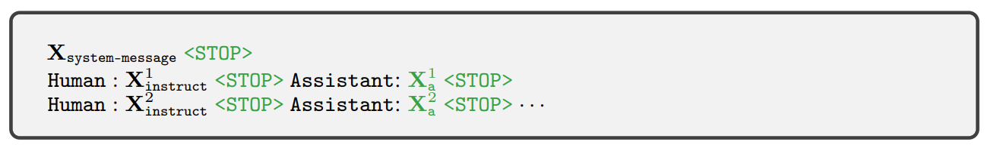
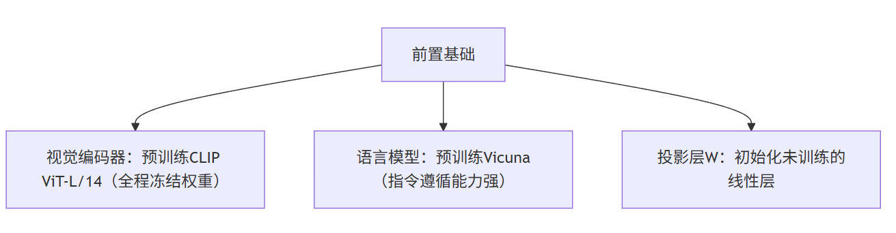
2. 阶段 1：特征对齐预训练 
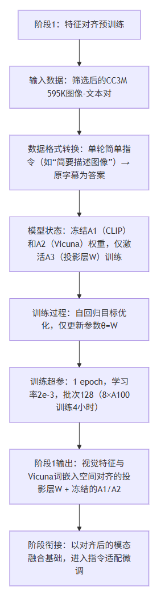
   1. 核心目标 :让视觉特征与文本模型的词嵌入空间 “对齐”，相当于给 LLM 训练 “视觉分词器”
   2. 输入数据 :筛选后的 CC3M 595K 图像 - 文本对（转化为 “简单指令格式”：随机采样 “描述图像” 类问题，原字幕作为答案）
   3. 数据格式 :单轮对话（Human: 简要描述这张图？ <STOP> Assistant: 原字幕 <STOP>）
   4. 训练方式 :冻结视觉编码器（CLIP）和文本模型（Vicuna）的全部权重，仅训练投影层W
   5. 参数更新范围 :仅θ=W（线性投影层）
   6. 关键作用 :解决 “模态鸿沟”：将 CLIP 输出的视觉特征Zv转化为与 Vicuna 词嵌入维度一致的Hv，确保视觉信息能被文本模型 “读懂”

3. 阶段 2：端到端微调
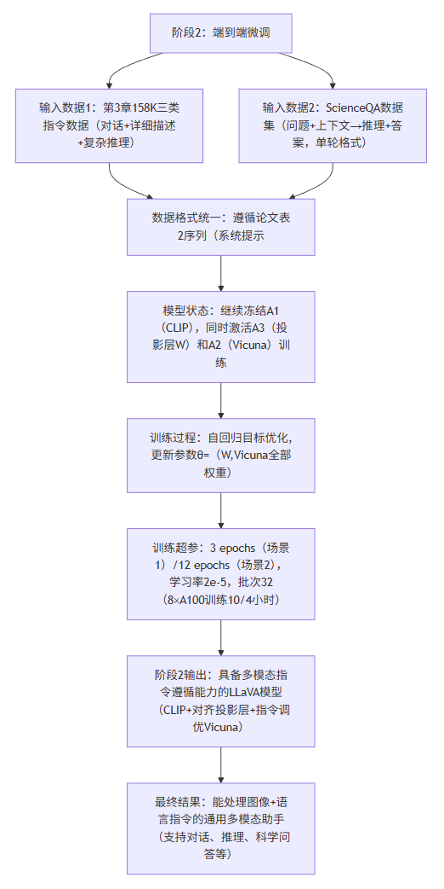
   1. 核心目标 :LLM 训练 “视觉分词器”让模型学习 “视觉 tokens + 语言指令” 到 “响应” 的映射，提升多模态指令遵循和推理能力
   2. 输入数据:
      1. 多模态聊天机器人：第 3 章生成的 158K 三类指令数据（对话、详细描述、复杂推理，均匀采样多轮 / 单轮数据）；
      2. ScienceQA：组织为 “问题 + 上下文→推理 + 答案” 的单轮对话格式
   3. 数据格式 :多轮 / 单轮混合对话（遵循论文表 2 格式：系统提示 <STOP> Human: 指令1 <STOP> Assistant: 响应1 <STOP> Human: 指令2 <STOP> Assistant: 响应2 <STOP>...）
   4. 训练方式 :冻结视觉编码器权重，同时训练投影层W和文本模型（Vicuna）的全部权重
   5. 参数更新范围 :θ={W, φ}（投影层 + Vicuna 的所有可训练参数）
   6. 关键作用 :适配具体任务：让模型在真实指令数据上学习交互逻辑（如多轮对话连贯性）、推理逻辑（如复杂问题分步推导），对齐人类意图

# 4.实验
1. 多模态聊天机器人实验
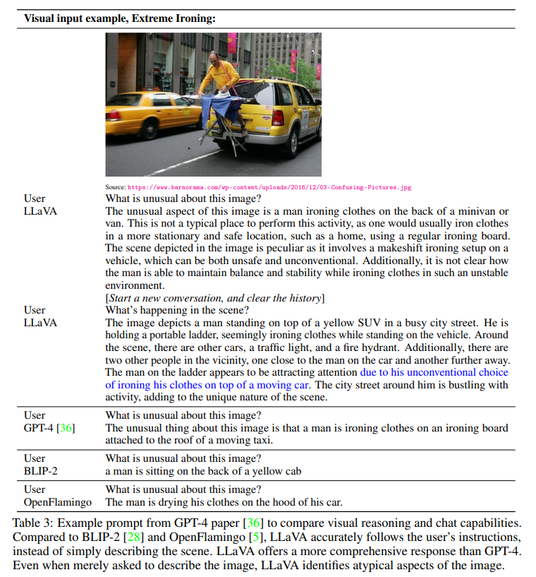
LLaVA 明确指出 “车顶上熨衣服” 的异常性，分析 “非固定场景→不安全→不常规” 的逻辑，细节全面
2. 定量基准评估
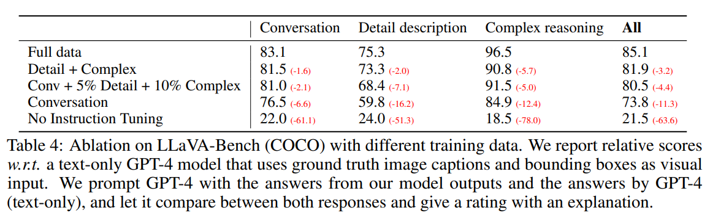
   - 指令调优的有效性：相比无指令调优，全量数据训练后综合得分提升 63.6 分，证明视觉指令调优的核心价值；
   - 数据多样性的重要性：全量三类数据表现最优，且推理类数据能正向带动对话能力（仅对话类 76.5→全量 83.1），说明推理能力与交互能力互补；
   - 复杂推理数据的权重：复杂推理类得分最高（96.5），证明模型能通过指令数据学会深度推理。
3. 主流模型对比
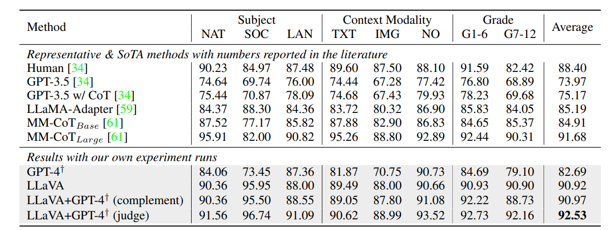
   - LLaVA 单独表现接近 SOTA：综合准确率 90.92%，仅比 MM-CoT 低 0.76%，证明视觉指令调优在专业领域的有效性；
   - 与 GPT-4 融合创 SOTA：通过 “GPT-4 作为裁判”（当 LLaVA 与 GPT-4 答案不一致时，让 GPT-4 结合两者结果重判），综合准确率达 92.53%，成为新 SOTA；
   - 纯文本 LLM 的辅助价值：GPT-4 无法处理图像，但能通过逻辑判断修正 LLaVA 的错误（如识别 “无需图像即可解答的多模态问题”），证明跨模型融合的潜力。

4. 消融实验
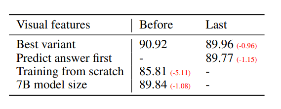
   - clip倒数第二层特征更聚焦局部细节，更适配科学问答的细粒度推理需求
   - 推理优先策略能加速收敛（6 epochs 达 89.77%），但对最终性能提升有限
   - 预训练是模态融合的关键，跳过会导致特征对齐不足，性能大幅下降
   - 模型规模对性能有正向影响，13B 模型的语义理解和推理能力更强

# 问题
1. LLaVA 实现视觉 - 语言模态融合的核心组件有哪些？各自的核心作用是什么？
2. 论文提出的两阶段训练策略中，阶段 1（特征对齐预训练）和阶段 2（端到端微调）在 “数据选择、训练目标、参数更新范围” 上的核心差异是什么？
3. GPT-4 辅助的多模态指令数据生成 pipeline，解决了多模态指令调优的哪个核心痛点？其关键步骤（从图像到指令数据）是什么？

# 知识点
- 视觉指令调优 
  目标是让模型 “听懂人类的视觉 - 语言指令并执行”，比如用户问 “这张图里的人在面临什么挑战？”“详细描述这张照片的细节”，模型能针对性响应。核心聚焦 “提升模型的指令遵循能力和交互性”，让模型从 “被动做特定任务” 变成 “主动配合人类意图”。
- 视觉提示调优 
  目标是 “让预训练视觉模型快速适配新任务，同时不用全量微调所有参数”，比如用一个预训练好的图像分类模型适配 “识别罕见花卉” 任务，只需调整少量与 “提示” 相关的参数（而非整个模型）。核心聚焦 “提升参数效率”，降低模型适配新任务的训练成本和计算资源消耗。
