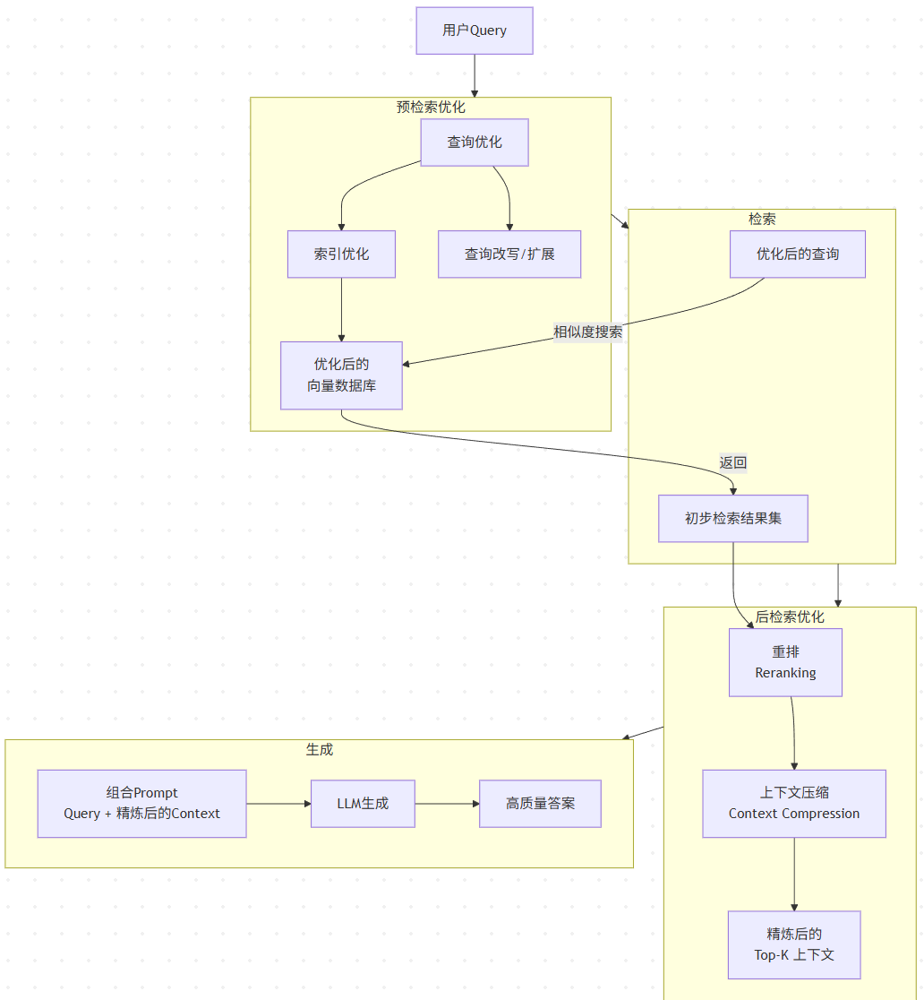
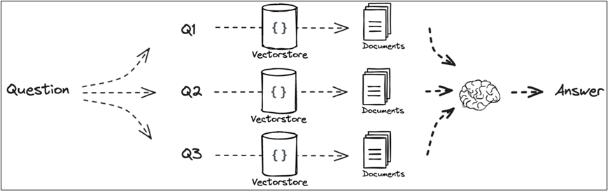
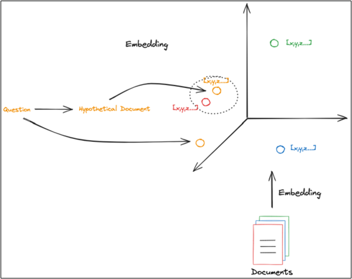
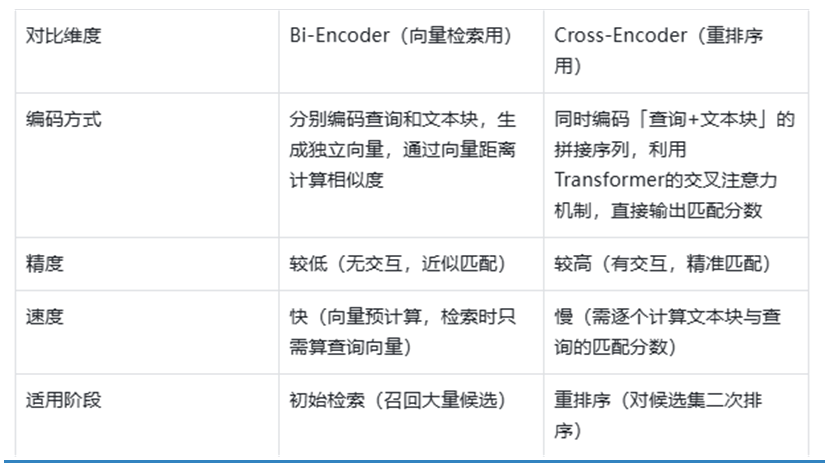

# RAG简介
参考文献：Retrieval-Augmented Generation for Large
Language Models: A Survey (https://arxiv.org/abs/2312.10997)

# 1.引言：什么是 RAG，为什么需要 RAG
1. RAG（Retrieval-Augmented Generation）检索增强生成，核心定位（连接外部知识库与大模型，解决幻觉、知识过时问题） 
    - RAG的基本思想为：将传统的生成式 LLM 和实时信息检索技术相结合，为 LLM 补充来自外部的相关数据和上下文，来帮助 LLM 生成更加准确可靠的内容。这使得 LLM 在生成内容时可以依赖实时与个性化的数据和知识，而非仅仅依赖训练知识。

2. 研究背景
   1. 时间范围 
      - 起点：并非从信息检索的最初概念开始，而是牢牢锚定在Transformer架构兴起和ChatGPT发布这两个关键节点之后。它关注的是RAG如何与拥有强大“上下文学习”能力的LLMs结合，并随之演进。
      - 早期：与预训练模型结合，注入知识。
      - ChatGPT后：重心转向为LLM的推理阶段提供更好的外部知识，以应对复杂、知识密集型任务。
      - 当前：与微调技术深度融合，进入模块化、自适应、可训练的协同阶段。
   2. 技术范围 
      - 范式层（宏观）：Naive RAG → Advanced RAG → Modular RAG的演进范式。
      - 组件层（中观）：深度拆解了RAG系统的三大核心组件：
        1. 检索：涵盖了从数据源、分块、索引优化、查询改写到嵌入模型的所有环节。
        2. 生成：聚焦于检索后处理（重排、压缩）以及对LLM本身的调整（微调、对齐）。
        3. 增强：这是该综述的一个亮点，它专门将“增强过程”独立出来，系统分析了Once、Iterative、Recursive、Adaptive等不同的增强策略。
      - 技术点层（微观）如HyDE、Step-Back Prompting、Self-RAG、FLARE等。
      
# 2.RAG 核心架构与整体流程
1. 核心架构图

2. 整体流程： 
通常情况下，可以将一个RAG应用分为数据索引（Indexing）和数据查询（Query）两个阶段：
   1. 数据索引阶段
      1. 加载（Loading）：RAG应用需要的知识数据可能以不同形式不同格式存在，可能是结构化、半结构化、非结构化的数据，可能是PDF、HTML、Word或Markdown等格式，需要对这些数据统一进行处理和解析，将其转换为能够读取和使用的数据。
      2. 分割（Splitting）：为了能够更精确地检索到相关数据，需要将一个较大的内容分割成一个个小的知识块。
      3. 嵌入（Embedding）：分割成一个个知识块之后，需要对知识块进行嵌入，将知识块转换为向量。
      4. 索引（Indexing）：将向量化之后的知识块存储到向量数据库中。向量数据库会提供强大的向量检索算法与管理接口，后续可以方便地对输入问题进行语义检索。不过索引形式也并非只有向量数据库索引这一种，很多应用也会根据自身需要来构造其他形式的索引，如知识图谱索引、关键词表索引等。
   2. 数据查询阶段
      1. 检索（Retrieval）：检索是借助数据索引从存储库中查找出相关的知识块，并按照相关性进行排序。经过排序的知识块将作为参考上下文用于协助后续的生成。
      2. 生成（Generation）：将检索阶段输出的相关知识块与用户原始的查询问题构造为 Prompt，输入给 LLM，LLM 根据 Prompt 生成内容。
      
# 3.RAG范式
1. Naive RAG 
    
   1. 流程
      1. 索引
         - 目标：为外部知识库做好检索准备。
         - 步骤：
            1. 数据加载与清洗：从多种格式的原始数据开始，将其转换为纯文本。
            2. 文本分割：将长文本切分成更小的“块”。这是因为LLM有上下文窗口限制。
            3. 向量化：使用嵌入模型将每个文本块转换为一个高维向量。
            4. 存储：将这些向量及其对应的原始文本存储到向量数据库中。
      2. 检索
        - 目标：找到与用户问题最相关的知识片段。
          - 步骤：
            1. 查询向量化：使用同一个嵌入模型将用户查询转换为向量。
            2. 相似度搜索：在向量数据库中，计算查询向量与所有文本块向量的相似度。
            3. Top-K检索：返回相似度最高的K个文本块，作为增强LLM的“上下文”。
      3. 生成
        - 目标：利用检索到的上下文生成最终答案。
        - 步骤：
          1. 提示构建：将用户查询和检索到的Top-K文本块组合成一个详细的提示。
          2. LLM生成：将构建好的提示输入给LLM，指令其基于提供的上下文生成答案。
   2. 缺陷
      1. 检索阶段的挑战 
         1. 精度不足：
           - 语义相似性 ≠ 答案正确性：系统可能检索到与查询语义相似但实际上不包含答案的文档。例如，查询“苹果公司的最新财报”，可能检索到一篇讨论“苹果”这种水果营养价值的文章，因为“苹果”一词的向量表示相似。
           - “迷失在中部”：LLM在处理长上下文时，倾向于关注开头和结尾部分，如果关键信息位于检索到的多个文档块中间，可能会被忽略。
         2. 召回率不足：
           - 检索粒度不当：如果分块过大，关键信息可能被淹没在无关文本中，导致相似度得分低；如果分块过小，可能无法保留完整的语义信息。
           - 词汇鸿沟：查询中的用词和文档中的用词不一致时，基于嵌入的检索可能失效。
      2. 生成阶段的困难
         1. 幻觉问题：LLM可能会忽略检索到的上下文，转而依赖其内部参数化知识（可能是过时或错误的）来生成答案，甚至编造不存在于上下文中的信息。
         2. 信息整合能力弱：当检索到多个相关文档块时，LLM可能无法有效地进行信息融合、去重和推理，导致答案冗长、重复或逻辑混乱。
         3. 忠实度低：生成的答案可能无法严格忠实于检索到的上下文，存在偏差或过度解读。
      3. 增强过程的局限
         1. 静态、单一检索：整个流程是“一次性”的。它基于原始查询检索一次，然后就生成答案。对于复杂、多步骤的问题，这种单次检索往往无法提供足够且全面的信息。
         2. 无法感知任务：检索过程是独立于下游生成任务的。它不知道LLM最终是要进行摘要、问答还是翻译，检索策略是“一刀切”的。
2. Advanced RAG

   1. 流程
        1. 预检索优化 
           1. 索引优化 - 打造更高质量的知识库 
                - 分块策略优化：
                    1. 滑动窗口：避免在固定分块时切断句子或段落边界的语义。
                    2. 小到大检索：先用小颗粒度（如句子）进行高精度检索，命中后将其周围的大上下文（如段落）一并提供给LLM，兼顾检索精度与语义完整性。
                    3. 语义分块：利用模型识别自然的话题边界进行分块，而非简单按长度切割。
                - 丰富元数据：
                    1. 为每个文本块附加元数据，如文档来源、作者、更新时间、章节标题等。
                    2. 在检索时，可以结合元数据过滤，例如只检索某个时间段内的文档，确保信息的时效性。
                - 假设性问题注入：
                    1. 也称为“Reverse HyDE”。在索引时，让LLM为每个文档块生成一些可能被该文档回答的“假设性问题”。
                    2. 检索时，计算用户问题与这些“假设性问题”的相似度，而非直接与文档块本身比较。这能有效弥合问题与答案之间的“语义鸿沟”。
           2. 查询优化 - 让问题问得更好
              - 查询改写：
                  1. 使用LLM对用户的原始查询进行重写，使其更清晰、完整或适合检索。
                  2. 例如，将口语化的“苹果那个最贵的玩意儿多少钱？”改写为“苹果公司最新款、最高配置的iPhone的官方售价是多少？”
              - 查询扩展：
                    
                  1. 多查询扩展：基于原问题，让LLM生成多个相关的查询视角，并行执行检索，然后合并结果，以扩大检索范围。
                  2. 子问题分解：对于复杂问题，使用“最少到最多提示”等方法，将原问题分解成一系列逻辑相关的子问题，逐个检索后再综合。
              - 查询转换：
                    
                  1. HyDE：让LLM根据原始查询生成一个假设的答案或文档。尽管这个生成内容可能不准确，但它抓住了答案的“语义轮廓”。然后用这个假设文档的向量去检索真实的文档，发现这种方法比用问题本身检索效果更好。
                  2. Step-Back Prompting：让LLM从原始问题中抽象出一个更通用、更高层的“概念性问题”进行检索，获取背景知识，再结合原问题进行回答。
        2. 后检索优化
           1. 重排
                
                - 目的：初步的向量相似度搜索返回的Top-K结果，其排序可能并非最优。重排模型会对这K个结果进行更精细的相关度计算，将最相关的内容排到最前面。
                - 初始检索（向量检索、关键词检索、混合检索）的结果排序，往往受限于底层算法的局限性：
                    1. 向量检索（Bi-Encoder）：为了检索速度，牺牲了查询与文本块的交互注意力，可能出现 “语义相似但实际不相关” 的文本块排在前列；
                    2. 关键词检索：容易受词频、停用词干扰，出现 “关键词匹配但语义无关” 的结果；
                    3. 混合检索：多检索器结果融合后，排序规则简单（如加权求和），无法精准衡量 “查询 - 文本块” 的匹配度。
                - 核心方法
                  1. 基于规则的重排序：
                        1. 元数据加权：为高优先级元数据的文本块加分。例如：“官方文档” 权重 > “用户手册” 权重；“最新版本” 权重 > “历史版本” 权重；
                        2. 文本特征过滤：惩罚低质量文本块。例如：过滤长度过短（<50 字符）或过长（>2000 字符）的块；惩罚与查询重叠词占比过低的块；
                        3. 去重优先：若多个文本块内容高度重叠，保留相似度最高的那个，其余降权；
                        4. 混合检索分数融合优化：对初始混合检索的向量分数和关键词分数，采用动态权重（而非固定权重）—— 比如短查询提升关键词分数权重，长查询提升向量分数权重。
                  2. 基于模型的重排序
                     1. 原理：使用专门的排序模型，计算「用户查询 + 文本块」的精准匹配分数，并根据分数重新排序。最常用的模型是 Cross-Encoder（交叉编码器），也是重排序的核心技术。
                     2. Cross-Encoder 核心原理
                        - 与向量检索用的 Bi-Encoder（双编码器） 对比，两者的核心差异在于是否让查询与文本块产生交互：
                        - 
                     3. Cross-Encoder 的工作流程：
                        - 初始检索召回 Top-K 候选文本块（如 K=50）；
                        - 将每个文本块与用户查询拼接，形成「查询 [SEP] 文本块」的输入序列；
                        - 送入 Cross-Encoder 模型，输出 0~1 的匹配分数（分数越高，相关性越强）；
                        - 按分数从高到低排序，选取 Top-N（如 N=5）作为最终上下文。
                  
           2. 上下文压缩与选择
              - 解决大模型上下文窗口限制和文本块冗余的问题。
              - 两个核心痛点：
                1. 窗口限制：大模型有固定的上下文长度上限（如 GPT-3.5 Turbo 是 4k Token，GPT-4 是 8k/32k Token），若重排序后的文本块总长度超出上限，会被截断，导致关键信息丢失；
                2. 内容冗余：检索召回的文本块可能包含大量无关信息（如文档页眉、广告、重复描述），冗余内容会干扰大模型的注意力，降低回答质量。
              - 核心方法：
                1. 基于规则的压缩
                   1. 原理：通过人工规则直接精简文本，无模型依赖，速度快。
                   2. 常见规则：
                        - 截断式压缩：按固定 Token 数截断文本块（如保留前 512 Token），或按句子边界截断（避免截断到句子中间）；
                        - 关键句提取：基于标点符号分割句子，保留包含查询关键词的句子，删除无关键词的句子；
                        - 去重压缩：去除文本块内的重复内容（如多次出现的 “本手册适用于 XX 产品”）；
                        - 格式清理：删除无意义的格式字符（如 Markdown 的 #、*，PDF 的页码、水印）。
                   3. 适用场景：文本块格式规范、冗余信息类型固定的场景；或作为模型压缩的前置步骤。
                      - 优点：实现简单、速度快、无计算成本；
                      - 缺点：无法理解语义，可能误删关键信息（如关键词出现在次要句子，核心语义在无关键词句子）。
                2. 基于模型的压缩
                   1. 模式 1：抽取式压缩（Extractive Compression）
                      - 原理：从原始文本块中抽取关键句子或短语，不生成新内容，仅做内容筛选。
                      - 技术实现：通过模型（如 TextRank、BERT）计算句子的重要性分数，保留分数最高的句子组合成压缩文本。
                      - 特点：忠于原文，无幻觉风险；但压缩比例有限（通常压缩至原长度的 50%~70%）。
                   2. 模式 2：抽象式压缩（Abstractive Compression）
                      - 原理：利用大模型（如 GPT-3.5、Llama）理解文本块的核心语义，用全新的、简洁的语言重述关键信息，允许生成原文中没有的句子。
                      - 典型流程：
                        1. 输入提示词给 LLM：“请你压缩以下文本，保留与查询【{用户查询}】相关的核心信息，删除冗余内容，压缩后的文本不超过{X} Token，不要添加额外信息。”
                        2. 将重排序后的文本块和提示词送入 LLM，得到压缩后的文本。
                        3. 特点：压缩比例高（可压缩至原长度的 20%~30%），语义更凝练；但依赖 LLM 的能力，存在少量幻觉风险。
3. Modular RAG 

