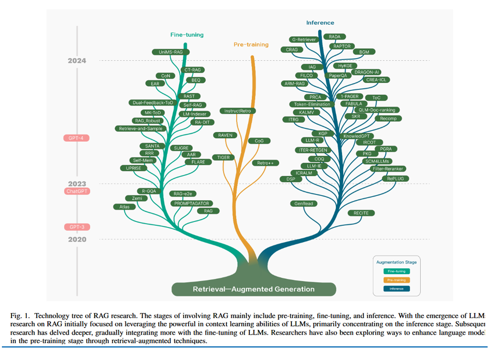
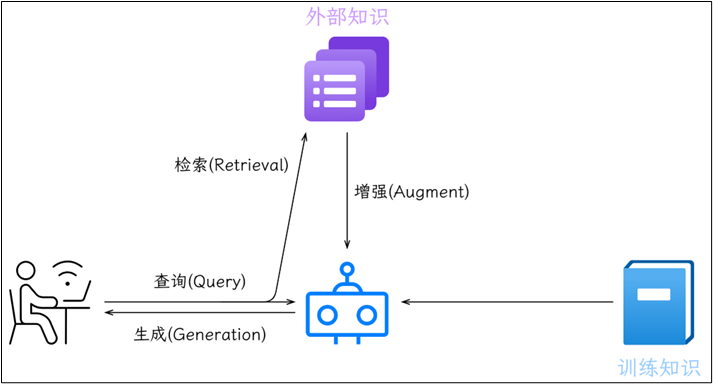
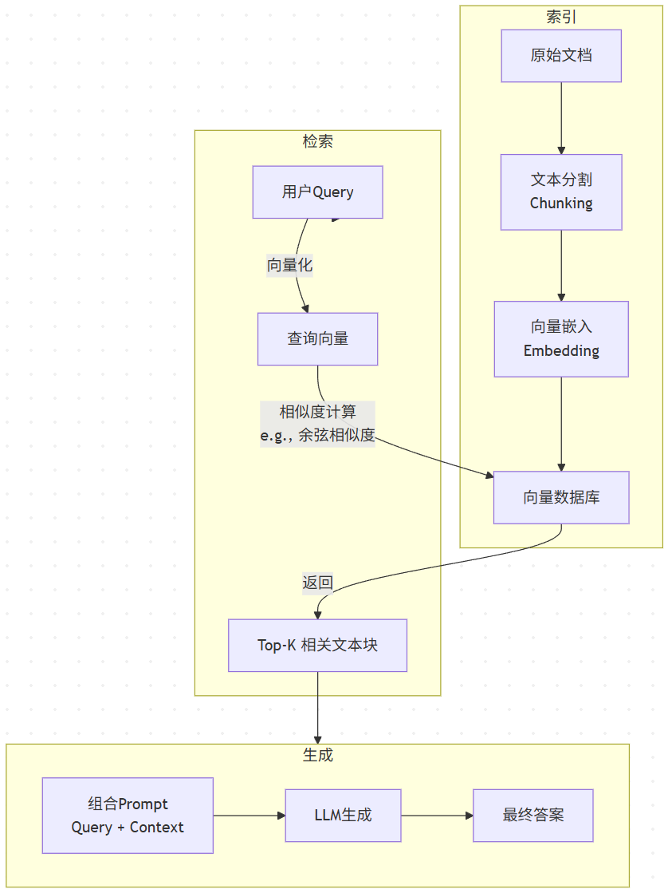

# RAG简介
参考文献：Retrieval-Augmented Generation for Large
Language Models: A Survey (https://arxiv.org/abs/2312.10997)

# 1.引言：什么是 RAG，为什么需要 RAG
1. RAG（Retrieval-Augmented Generation）检索增强生成，核心定位（连接外部知识库与大模型，解决幻觉、知识过时问题） 
    - RAG的基本思想为：将传统的生成式 LLM 和实时信息检索技术相结合，为 LLM 补充来自外部的相关数据和上下文，来帮助 LLM 生成更加准确可靠的内容。这使得 LLM 在生成内容时可以依赖实时与个性化的数据和知识，而非仅仅依赖训练知识。

2. 研究背景
   1. 时间范围 
      - 起点：并非从信息检索的最初概念开始，而是牢牢锚定在Transformer架构兴起和ChatGPT发布这两个关键节点之后。它关注的是RAG如何与拥有强大“上下文学习”能力的LLMs结合，并随之演进。
      - 早期：与预训练模型结合，注入知识。
      - ChatGPT后：重心转向为LLM的推理阶段提供更好的外部知识，以应对复杂、知识密集型任务。
      - 当前：与微调技术深度融合，进入模块化、自适应、可训练的协同阶段。
   2. 技术范围 
      - 范式层（宏观）：Naive RAG → Advanced RAG → Modular RAG的演进范式。
      - 组件层（中观）：深度拆解了RAG系统的三大核心组件：
        1. 检索：涵盖了从数据源、分块、索引优化、查询改写到嵌入模型的所有环节。
        2. 生成：聚焦于检索后处理（重排、压缩）以及对LLM本身的调整（微调、对齐）。
        3. 增强：这是该综述的一个亮点，它专门将“增强过程”独立出来，系统分析了Once、Iterative、Recursive、Adaptive等不同的增强策略。
      - 技术点层（微观）如HyDE、Step-Back Prompting、Self-RAG、FLARE等。
      
# 2.RAG 核心架构与整体流程
1. 核心架构图

2. 整体流程： 
通常情况下，可以将一个RAG应用分为数据索引（Indexing）和数据查询（Query）两个阶段：
   1. 数据索引阶段
      1. 加载（Loading）：RAG应用需要的知识数据可能以不同形式不同格式存在，可能是结构化、半结构化、非结构化的数据，可能是PDF、HTML、Word或Markdown等格式，需要对这些数据统一进行处理和解析，将其转换为能够读取和使用的数据。
      2. 分割（Splitting）：为了能够更精确地检索到相关数据，需要将一个较大的内容分割成一个个小的知识块。
      3. 嵌入（Embedding）：分割成一个个知识块之后，需要对知识块进行嵌入，将知识块转换为向量。
      4. 索引（Indexing）：将向量化之后的知识块存储到向量数据库中。向量数据库会提供强大的向量检索算法与管理接口，后续可以方便地对输入问题进行语义检索。不过索引形式也并非只有向量数据库索引这一种，很多应用也会根据自身需要来构造其他形式的索引，如知识图谱索引、关键词表索引等。
   2. 数据查询阶段
      1. 检索（Retrieval）：检索是借助数据索引从存储库中查找出相关的知识块，并按照相关性进行排序。经过排序的知识块将作为参考上下文用于协助后续的生成。
      2. 生成（Generation）：将检索阶段输出的相关知识块与用户原始的查询问题构造为 Prompt，输入给 LLM，LLM 根据 Prompt 生成内容。
      
# 3.RAG范式
1. Naive RAG
    
   1. 流程
      1. 索引
         - 目标：为外部知识库做好检索准备。
         - 步骤：
            数据加载与清洗：从多种格式的原始数据开始，将其转换为纯文本。
            文本分割：将长文本切分成更小的“块”。这是因为LLM有上下文窗口限制。
            向量化：使用嵌入模型将每个文本块转换为一个高维向量。
            存储：将这些向量及其对应的原始文本存储到向量数据库中。
2. 检索
  目标：找到与用户问题最相关的知识片段。
  步骤：
    查询向量化：使用同一个嵌入模型将用户查询转换为向量。
    相似度搜索：在向量数据库中，计算查询向量与所有文本块向量的相似度。
    Top-K检索：返回相似度最高的K个文本块，作为增强LLM的“上下文”。
3. 生成
  目标：利用检索到的上下文生成最终答案。
  步骤：
    提示构建：将用户查询和检索到的Top-K文本块组合成一个详细的提示。
    LLM生成：将构建好的提示输入给LLM，指令其基于提供的上下文生成答案。

