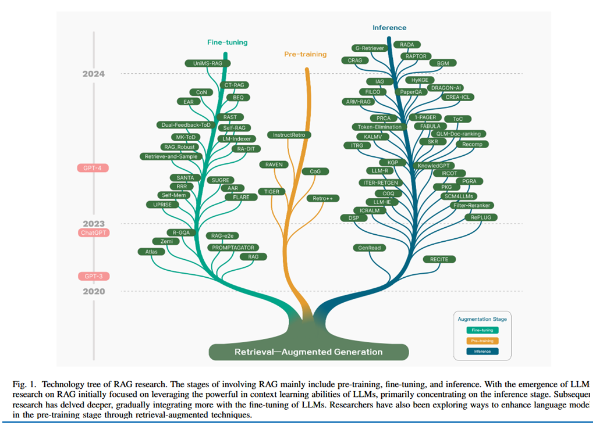
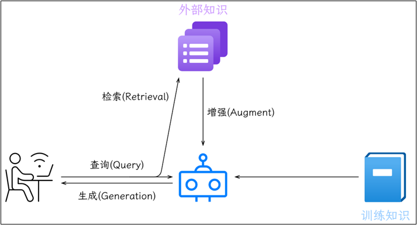
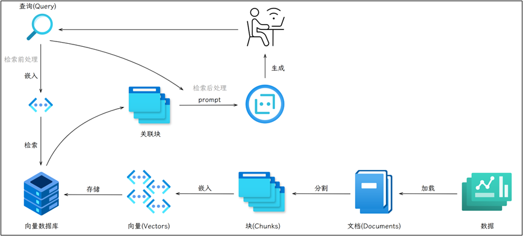
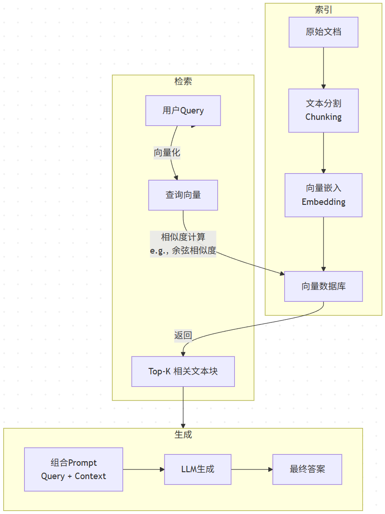
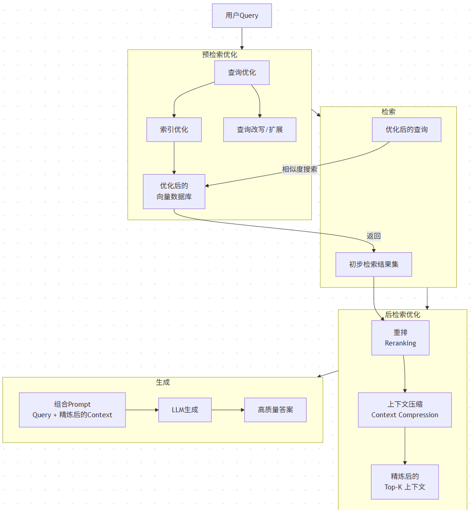
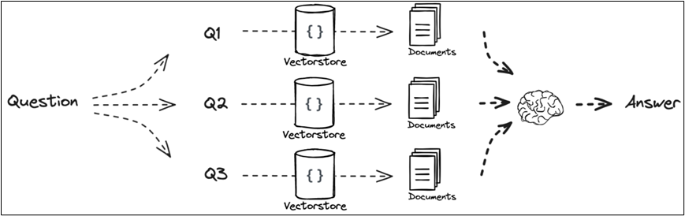
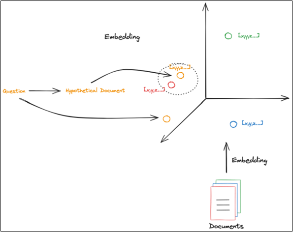
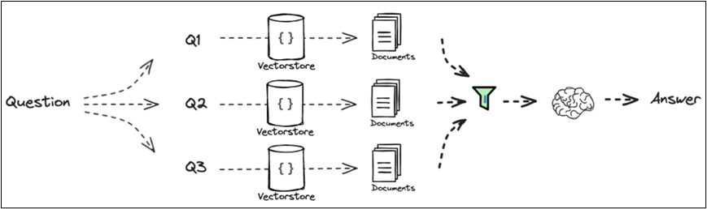
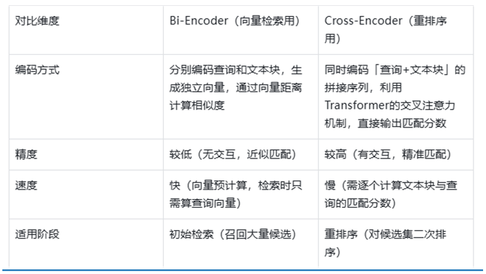
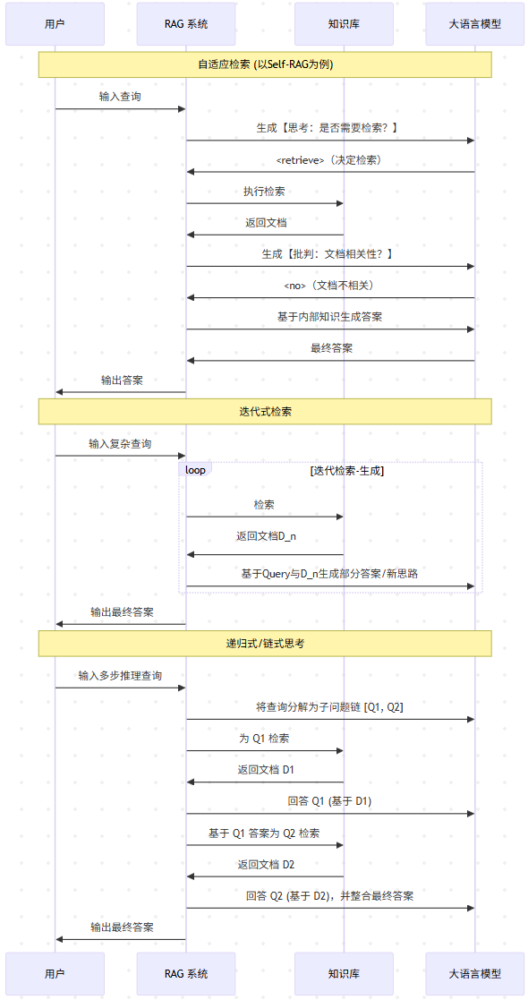

# RAG简介
参考文献：Retrieval-Augmented Generation for Large
Language Models: A Survey (https://arxiv.org/abs/2312.10997)

# 1.引言：什么是 RAG，为什么需要 RAG
1. RAG（Retrieval-Augmented Generation）检索增强生成，核心定位（连接外部知识库与大模型，解决幻觉、知识过时问题） 
    - RAG的基本思想为：将传统的生成式 LLM 和实时信息检索技术相结合，为 LLM 补充来自外部的相关数据和上下文，来帮助 LLM 生成更加准确可靠的内容。这使得 LLM 在生成内容时可以依赖实时与个性化的数据和知识，而非仅仅依赖训练知识。

2. 研究背景
   1. 时间范围 
      - 起点：并非从信息检索的最初概念开始，而是牢牢锚定在Transformer架构兴起和ChatGPT发布这两个关键节点之后。它关注的是RAG如何与拥有强大“上下文学习”能力的LLMs结合，并随之演进。
      - 早期：与预训练模型结合，注入知识。
      - ChatGPT后：重心转向为LLM的推理阶段提供更好的外部知识，以应对复杂、知识密集型任务。
      - 当前：与微调技术深度融合，进入模块化、自适应、可训练的协同阶段。
   2. 技术范围 
      - 范式层（宏观）：Naive RAG → Advanced RAG → Modular RAG的演进范式。
      - 组件层（中观）：深度拆解了RAG系统的三大核心组件：
        1. 检索：涵盖了从数据源、分块、索引优化、查询改写到嵌入模型的所有环节。
        2. 生成：聚焦于检索后处理（重排、压缩）以及对LLM本身的调整（微调、对齐）。
        3. 增强：这是该综述的一个亮点，它专门将“增强过程”独立出来，系统分析了Once、Iterative、Recursive、Adaptive等不同的增强策略。
      - 技术点层（微观）如HyDE、Step-Back Prompting、Self-RAG、FLARE等。
      
# 2.RAG 核心架构与整体流程
1. 核心架构图

2. 整体流程： 
通常情况下，可以将一个RAG应用分为数据索引（Indexing）和数据查询（Query）两个阶段：
   1. 数据索引阶段
      1. 加载（Loading）：RAG应用需要的知识数据可能以不同形式不同格式存在，可能是结构化、半结构化、非结构化的数据，可能是PDF、HTML、Word或Markdown等格式，需要对这些数据统一进行处理和解析，将其转换为能够读取和使用的数据。
      2. 分割（Splitting）：为了能够更精确地检索到相关数据，需要将一个较大的内容分割成一个个小的知识块。
      3. 嵌入（Embedding）：分割成一个个知识块之后，需要对知识块进行嵌入，将知识块转换为向量。
      4. 索引（Indexing）：将向量化之后的知识块存储到向量数据库中。向量数据库会提供强大的向量检索算法与管理接口，后续可以方便地对输入问题进行语义检索。不过索引形式也并非只有向量数据库索引这一种，很多应用也会根据自身需要来构造其他形式的索引，如知识图谱索引、关键词表索引等。
   2. 数据查询阶段
      1. 检索（Retrieval）：检索是借助数据索引从存储库中查找出相关的知识块，并按照相关性进行排序。经过排序的知识块将作为参考上下文用于协助后续的生成。
      2. 生成（Generation）：将检索阶段输出的相关知识块与用户原始的查询问题构造为 Prompt，输入给 LLM，LLM 根据 Prompt 生成内容。
      
# 3.RAG范式
1. Naive RAG 
    
   1. 流程
      1. 索引
         - 目标：为外部知识库做好检索准备。
         - 步骤：
            1. 数据加载与清洗：从多种格式的原始数据开始，将其转换为纯文本。
            2. 文本分割：将长文本切分成更小的“块”。这是因为LLM有上下文窗口限制。
            3. 向量化：使用嵌入模型将每个文本块转换为一个高维向量。
            4. 存储：将这些向量及其对应的原始文本存储到向量数据库中。
      2. 检索
        - 目标：找到与用户问题最相关的知识片段。
          - 步骤：
            1. 查询向量化：使用同一个嵌入模型将用户查询转换为向量。
            2. 相似度搜索：在向量数据库中，计算查询向量与所有文本块向量的相似度。
            3. Top-K检索：返回相似度最高的K个文本块，作为增强LLM的“上下文”。
      3. 生成
        - 目标：利用检索到的上下文生成最终答案。
        - 步骤：
          1. 提示构建：将用户查询和检索到的Top-K文本块组合成一个详细的提示。
          2. LLM生成：将构建好的提示输入给LLM，指令其基于提供的上下文生成答案。
   2. 缺陷
      1. 检索阶段的挑战 
         1. 精度不足：
           - 语义相似性 ≠ 答案正确性：系统可能检索到与查询语义相似但实际上不包含答案的文档。例如，查询“苹果公司的最新财报”，可能检索到一篇讨论“苹果”这种水果营养价值的文章，因为“苹果”一词的向量表示相似。
           - “迷失在中部”：LLM在处理长上下文时，倾向于关注开头和结尾部分，如果关键信息位于检索到的多个文档块中间，可能会被忽略。
         2. 召回率不足：
           - 检索粒度不当：如果分块过大，关键信息可能被淹没在无关文本中，导致相似度得分低；如果分块过小，可能无法保留完整的语义信息。
           - 词汇鸿沟：查询中的用词和文档中的用词不一致时，基于嵌入的检索可能失效。
      2. 生成阶段的困难
         1. 幻觉问题：LLM可能会忽略检索到的上下文，转而依赖其内部参数化知识（可能是过时或错误的）来生成答案，甚至编造不存在于上下文中的信息。
         2. 信息整合能力弱：当检索到多个相关文档块时，LLM可能无法有效地进行信息融合、去重和推理，导致答案冗长、重复或逻辑混乱。
         3. 忠实度低：生成的答案可能无法严格忠实于检索到的上下文，存在偏差或过度解读。
      3. 增强过程的局限
         1. 静态、单一检索：整个流程是“一次性”的。它基于原始查询检索一次，然后就生成答案。对于复杂、多步骤的问题，这种单次检索往往无法提供足够且全面的信息。
         2. 无法感知任务：检索过程是独立于下游生成任务的。它不知道LLM最终是要进行摘要、问答还是翻译，检索策略是“一刀切”的。
2. Advanced RAG

   1. 流程
        1. 预检索优化 
           1. 索引优化 - 打造更高质量的知识库 
                - 分块策略优化：
                    1. 滑动窗口：避免在固定分块时切断句子或段落边界的语义。
                    2. 小到大检索：先用小颗粒度（如句子）进行高精度检索，命中后将其周围的大上下文（如段落）一并提供给LLM，兼顾检索精度与语义完整性。
                    3. 语义分块：利用模型识别自然的话题边界进行分块，而非简单按长度切割。
                - 丰富元数据：
                    1. 为每个文本块附加元数据，如文档来源、作者、更新时间、章节标题等。
                    2. 在检索时，可以结合元数据过滤，例如只检索某个时间段内的文档，确保信息的时效性。
                - 假设性问题注入：
                    1. 也称为“Reverse HyDE”。在索引时，让LLM为每个文档块生成一些可能被该文档回答的“假设性问题”。
                    2. 检索时，计算用户问题与这些“假设性问题”的相似度，而非直接与文档块本身比较。这能有效弥合问题与答案之间的“语义鸿沟”。
           2. 查询优化 - 让问题问得更好
              - 查询改写：
                  1. 使用LLM对用户的原始查询进行重写，使其更清晰、完整或适合检索。
                  2. 例如，将口语化的“苹果那个最贵的玩意儿多少钱？”改写为“苹果公司最新款、最高配置的iPhone的官方售价是多少？”
              - 查询扩展：
                    
                  1. 多查询扩展：基于原问题，让LLM生成多个相关的查询视角，并行执行检索，然后合并结果，以扩大检索范围。
                  2. 子问题分解：对于复杂问题，使用“最少到最多提示”等方法，将原问题分解成一系列逻辑相关的子问题，逐个检索后再综合。
              - 查询转换：
                    
                  1. HyDE：让LLM根据原始查询生成一个假设的答案或文档。尽管这个生成内容可能不准确，但它抓住了答案的“语义轮廓”。然后用这个假设文档的向量去检索真实的文档，发现这种方法比用问题本身检索效果更好。
                  2. Step-Back Prompting：让LLM从原始问题中抽象出一个更通用、更高层的“概念性问题”进行检索，获取背景知识，再结合原问题进行回答。
        2. 后检索优化
           1. 重排
                
                - 目的：初步的向量相似度搜索返回的Top-K结果，其排序可能并非最优。重排模型会对这K个结果进行更精细的相关度计算，将最相关的内容排到最前面。
                - 初始检索（向量检索、关键词检索、混合检索）的结果排序，往往受限于底层算法的局限性：
                    1. 向量检索（Bi-Encoder）：为了检索速度，牺牲了查询与文本块的交互注意力，可能出现 “语义相似但实际不相关” 的文本块排在前列；
                    2. 关键词检索：容易受词频、停用词干扰，出现 “关键词匹配但语义无关” 的结果；
                    3. 混合检索：多检索器结果融合后，排序规则简单（如加权求和），无法精准衡量 “查询 - 文本块” 的匹配度。
                - 核心方法
                  1. 基于规则的重排序：
                        1. 元数据加权：为高优先级元数据的文本块加分。例如：“官方文档” 权重 > “用户手册” 权重；“最新版本” 权重 > “历史版本” 权重；
                        2. 文本特征过滤：惩罚低质量文本块。例如：过滤长度过短（<50 字符）或过长（>2000 字符）的块；惩罚与查询重叠词占比过低的块；
                        3. 去重优先：若多个文本块内容高度重叠，保留相似度最高的那个，其余降权；
                        4. 混合检索分数融合优化：对初始混合检索的向量分数和关键词分数，采用动态权重（而非固定权重）—— 比如短查询提升关键词分数权重，长查询提升向量分数权重。
                  2. 基于模型的重排序
                     1. 原理：使用专门的排序模型，计算「用户查询 + 文本块」的精准匹配分数，并根据分数重新排序。最常用的模型是 Cross-Encoder（交叉编码器），也是重排序的核心技术。
                     2. Cross-Encoder 核心原理
                        - 与向量检索用的 Bi-Encoder（双编码器） 对比，两者的核心差异在于是否让查询与文本块产生交互：
                        - 
                     3. Cross-Encoder 的工作流程：
                        - 初始检索召回 Top-K 候选文本块（如 K=50）；
                        - 将每个文本块与用户查询拼接，形成「查询 [SEP] 文本块」的输入序列；
                        - 送入 Cross-Encoder 模型，输出 0~1 的匹配分数（分数越高，相关性越强）；
                        - 按分数从高到低排序，选取 Top-N（如 N=5）作为最终上下文。
                  
           2. 上下文压缩与选择
              - 解决大模型上下文窗口限制和文本块冗余的问题。
              - 两个核心痛点：
                1. 窗口限制：大模型有固定的上下文长度上限（如 GPT-3.5 Turbo 是 4k Token，GPT-4 是 8k/32k Token），若重排序后的文本块总长度超出上限，会被截断，导致关键信息丢失；
                2. 内容冗余：检索召回的文本块可能包含大量无关信息（如文档页眉、广告、重复描述），冗余内容会干扰大模型的注意力，降低回答质量。
              - 核心方法：
                1. 基于规则的压缩
                   1. 原理：通过人工规则直接精简文本，无模型依赖，速度快。
                   2. 常见规则：
                        - 截断式压缩：按固定 Token 数截断文本块（如保留前 512 Token），或按句子边界截断（避免截断到句子中间）；
                        - 关键句提取：基于标点符号分割句子，保留包含查询关键词的句子，删除无关键词的句子；
                        - 去重压缩：去除文本块内的重复内容（如多次出现的 “本手册适用于 XX 产品”）；
                        - 格式清理：删除无意义的格式字符（如 Markdown 的 #、*，PDF 的页码、水印）。
                   3. 适用场景：文本块格式规范、冗余信息类型固定的场景；或作为模型压缩的前置步骤。
                      - 优点：实现简单、速度快、无计算成本；
                      - 缺点：无法理解语义，可能误删关键信息（如关键词出现在次要句子，核心语义在无关键词句子）。
                2. 基于模型的压缩
                   1. 模式 1：抽取式压缩（Extractive Compression）
                      - 原理：从原始文本块中抽取关键句子或短语，不生成新内容，仅做内容筛选。
                      - 技术实现：通过模型（如 TextRank、BERT）计算句子的重要性分数，保留分数最高的句子组合成压缩文本。
                      - 特点：忠于原文，无幻觉风险；但压缩比例有限（通常压缩至原长度的 50%~70%）。
                   2. 模式 2：抽象式压缩（Abstractive Compression）
                      - 原理：利用大模型（如 GPT-3.5、Llama）理解文本块的核心语义，用全新的、简洁的语言重述关键信息，允许生成原文中没有的句子。
                      - 典型流程：
                        1. 输入提示词给 LLM：“请你压缩以下文本，保留与查询【{用户查询}】相关的核心信息，删除冗余内容，压缩后的文本不超过{X} Token，不要添加额外信息。”
                        2. 将重排序后的文本块和提示词送入 LLM，得到压缩后的文本。
                        3. 特点：压缩比例高（可压缩至原长度的 20%~30%），语义更凝练；但依赖 LLM 的能力，存在少量幻觉风险。
3. Modular RAG 

 

写成markdown格式发给我：
好的，我来为你从头到尾详细讲解香农编码，确保每个概念都清晰，并附上完整的例子和练习题。

---

## 一、香农编码是什么？

香农编码（Shannon Coding）是信息论创始人克劳德·香农提出的第一种实用的变长编码方法。它根据符号出现的概率大小，为每个符号分配一个二进制码字，使得**大概率符号用短码，小概率符号用长码**，从而平均码长接近信源熵，实现数据压缩。

---

## 二、核心思想

想象我们把区间 \([0,1)\) 按照每个符号的概率大小划分成若干段，每个符号对应一个子区间。然后我们用**子区间起点的二进制小数**的前若干位作为该符号的码字。这样，由于不同符号的区间不重叠，它们的码字也一定不会冲突，而且大概率符号的区间长，需要的二进制位数少；小概率符号的区间短，需要的位数多。

---

## 三、编码步骤（标准流程）

假设信源有 \(n\) 个符号 \(x_1, x_2, ..., x_n\)，对应的概率为 \(p_1, p_2, ..., p_n\)，且所有概率之和为 1。

### 第1步：概率排序
将符号按概率从大到小排列（若概率相等，可任意排序，但顺序一旦固定就不能改变）。  
记排列后的符号为 \(s_1, s_2, ..., s_n\)，概率仍为 \(p_1 \ge p_2 \ge ... \ge p_n\)。

### 第2步：计算累积概率
对每个符号 \(s_i\)，计算累积概率 \(P_i = \sum_{k=1}^{i-1} p_k\)（即排在它前面所有符号的概率之和）。  
特别地，\(P_1 = 0\)。

### 第3步：确定码字长度
对每个符号 \(s_i\)，计算码字长度 \(l_i = \lceil -\log_2 p_i \rceil\)。  
这里 \(\lceil x \rceil\) 表示向上取整，即不小于 \(x\) 的最小整数。

> **为什么取这个长度？**  
> 因为长度为 \(l\) 的二进制前缀可以区分长度为 \(2^{-l}\) 的区间。要能唯一标识一个概率为 \(p_i\) 的区间，需要 \(2^{-l_i} \le p_i\)，即 \(l_i \ge -\log_2 p_i\)。取最小整数 \(l_i\) 既满足要求，又使码长尽可能短。

### 第4步：将累积概率转换为二进制小数，取前 \(l_i\) 位作为码字
将累积概率 \(P_i\) 表示成二进制小数（例如 0.1011…），然后取小数点后的前 \(l_i\) 位作为该符号的码字。如果二进制小数不足 \(l_i\) 位，则在末尾补 0（实际上因为 \(P_i\) 是有限小数或循环小数，截取时直接取前 \(l_i\) 位即可）。

> **注意**：累积概率 \(P_i\) 通常是一个十进制小数，我们需要把它转换成二进制。转换方法是“乘2取整法”：不断乘以2，取整数部分，余数继续乘2，直到得到足够的位数。

---

## 四、详细例子

### 例：信源符号及概率
设有四个符号 A, B, C, D，概率分别为：
- A: 0.4
- B: 0.3
- C: 0.2
- D: 0.1

### 步骤1：排序（已按降序排列）
| 符号 | 概率 \(p\) |
|------|------------|
| A    | 0.4        |
| B    | 0.3        |
| C    | 0.2        |
| D    | 0.1        |

### 步骤2：计算累积概率
- A：前面无符号，\(P_A = 0\)
- B：前面有A（0.4），\(P_B = 0.4\)
- C：前面有A和B（0.4+0.3=0.7），\(P_C = 0.7\)
- D：前面有A、B、C（0.4+0.3+0.2=0.9），\(P_D = 0.9\)

| 符号 | 概率 \(p\) | 累积概率 \(P\) |
|------|------------|----------------|
| A    | 0.4        | 0              |
| B    | 0.3        | 0.4            |
| C    | 0.2        | 0.7            |
| D    | 0.1        | 0.9            |

### 步骤3：计算码字长度
- A: \(-\log_2 0.4 \approx 1.3219\)，向上取整 → \(l_A = 2\)
- B: \(-\log_2 0.3 \approx 1.7369\)，向上取整 → \(l_B = 2\)
- C: \(-\log_2 0.2 \approx 2.3219\)，向上取整 → \(l_C = 3\)
- D: \(-\log_2 0.1 \approx 3.3219\)，向上取整 → \(l_D = 4\)

### 步骤4：将累积概率转二进制并取前 \(l_i\) 位

#### 符号 A
- 累积概率 \(P_A = 0\)
- 0 的二进制小数是 0.0000…  
- 取前 \(l_A=2\) 位 → 前两位是 “00”  
- 码字 = **00**

#### 符号 B
- 累积概率 \(P_B = 0.4\)
- 将 0.4 转为二进制（用乘2取整法）：
  - 0.4 × 2 = 0.8 → 整数部分 0，余 0.8
  - 0.8 × 2 = 1.6 → 整数部分 1，余 0.6
  - 0.6 × 2 = 1.2 → 整数部分 1，余 0.2
  - 0.2 × 2 = 0.4 → 整数部分 0，余 0.4
  - 循环…  
  所以 0.4 的二进制小数是 0.01100110…（前几位：0, 1, 1, 0, 0, 1, ...）
- 取前 \(l_B=2\) 位 → 前两位是 “01”  
- 码字 = **01**

#### 符号 C
- 累积概率 \(P_C = 0.7\)
- 将 0.7 转二进制：
  - 0.7 × 2 = 1.4 → 整数 1，余 0.4
  - 0.4 × 2 = 0.8 → 整数 0，余 0.8
  - 0.8 × 2 = 1.6 → 整数 1，余 0.6
  - 0.6 × 2 = 1.2 → 整数 1，余 0.2
  - 0.2 × 2 = 0.4 → 整数 0，余 0.4
  - 循环…  
  所以 0.7 的二进制小数是 0.10110011…（前几位：1, 0, 1, 1, 0, 0, ...）
- 取前 \(l_C=3\) 位 → 前三位是 “101”  
- 码字 = **101**

#### 符号 D
- 累积概率 \(P_D = 0.9\)
- 将 0.9 转二进制：
  - 0.9 × 2 = 1.8 → 整数 1，余 0.8
  - 0.8 × 2 = 1.6 → 整数 1，余 0.6
  - 0.6 × 2 = 1.2 → 整数 1，余 0.2
  - 0.2 × 2 = 0.4 → 整数 0，余 0.4
  - 0.4 × 2 = 0.8 → 整数 0，余 0.8
  - 循环…  
  所以 0.9 的二进制小数是 0.11100110…（前几位：1, 1, 1, 0, 0, 1, ...）
- 取前 \(l_D=4\) 位 → 前四位是 “1110”  
- 码字 = **1110**

### 最终编码表
| 符号 | 概率 | 累积概率 | 码长 | 码字 |
|------|------|----------|------|------|
| A    | 0.4  | 0        | 2    | 00   |
| B    | 0.3  | 0.4      | 2    | 01   |
| C    | 0.2  | 0.7      | 3    | 101  |
| D    | 0.1  | 0.9      | 4    | 1110 |

### 平均码长
\[
L = 0.4\times 2 + 0.3\times 2 + 0.2\times 3 + 0.1\times 4 = 0.8 + 0.6 + 0.6 + 0.4 = 2.4 \text{ 比特/符号}
\]

信源熵：
\[
H = -0.4\log_2 0.4 - 0.3\log_2 0.3 - 0.2\log_2 0.2 - 0.1\log_2 0.1 \approx 1.846 \text{ 比特/符号}
\]
平均码长 \(L = 2.4\)，大于熵，但小于 \(H+1 = 2.846\)，符合香农编码的理论界。

---

## 五、如何解码？

香农编码是**前缀码**（没有任何一个码字是另一个码字的前缀），因此解码时从左到右扫描二进制串，一旦匹配到某个码字，就输出对应符号，然后继续。  
例如上面的码字：`00`, `01`, `101`, `1110`。如果收到 `00101110`，解码过程：
- 读 `00` → A
- 剩下 `101110`，读 `101` → C
- 剩下 `110`，读 `1` ？不对，`1` 不是码字，继续读 `11` 也不是，读 `111` 也不是，读 `1110` → D
- 得到 A, C, D。

---

## 六、香农编码的优缺点

**优点**：
- 编码方法系统、简单，有严格的数学基础。
- 平均码长接近信源熵，压缩效率高。
- 码字是前缀码，无需分隔符即可唯一解码。

**缺点**：
- 对于某些概率分布，平均码长不如哈夫曼编码（哈夫曼编码总是最优的）。
- 需要对所有符号概率排序，且码长可能偏长（例如上例中D用了4位，而哈夫曼可能用3位）。
- 不适用于动态变化的信源（需要预先知道所有概率）。

---

## 七、练习题

### 题目1
已知一个信源有5个符号，概率分别为：0.5, 0.2, 0.1, 0.1, 0.1。  
请用香农编码为该信源编码，写出每个符号的码字，并计算平均码长。

### 题目2
一个信源有3个符号，概率分别为：0.6, 0.3, 0.1。  
（1）用香农编码写出每个符号的码字。  
（2）如果某接收端收到二进制序列 `01101110`，请根据你编码的结果解码出原始符号序列。

---

## 八、练习题参考答案

### 题目1 答案
排序后概率：0.5, 0.2, 0.1, 0.1, 0.1。  
累积概率：0, 0.5, 0.7, 0.8, 0.9。  
码长：  
- 0.5 → \(\lceil 1\rceil = 1\)  
- 0.2 → \(\lceil 2.3219\rceil = 3\)  
- 0.1 → \(\lceil 3.3219\rceil = 4\)（三个0.1的码长都是4）

二进制转换（取对应长度）：
- 0 → 0.0 → 取1位 → 0
- 0.5 → 0.1 → 取3位 → 100
- 0.7 → 0.101100… → 取4位 → 1011
- 0.8 → 0.110011… → 取4位 → 1100
- 0.9 → 0.111001… → 取4位 → 1110

平均码长 \(L = 0.5\times1 + 0.2\times3 + 0.1\times4 + 0.1\times4 + 0.1\times4 = 0.5 + 0.6 + 0.4 + 0.4 + 0.4 = 2.3\) 比特/符号。

### 题目2 答案
（1）编码  
排序：0.6, 0.3, 0.1  
累积概率：0, 0.6, 0.9  
码长：  
- 0.6 → \(\lceil 0.736\rceil = 1\)  
- 0.3 → \(\lceil 1.737\rceil = 2\)  
- 0.1 → \(\lceil 3.322\rceil = 4\)

二进制转换：
- 0 → 0.0 → 取1位 → 0
- 0.6 → 0.1001… → 取2位 → 10
- 0.9 → 0.1110… → 取4位 → 1110

所以：
A(0.6) → 0  
B(0.3) → 10  
C(0.1) → 1110

（2）解码 `01101110`  
扫描：
- 第一位 0 → A
- 剩下 `1101110`，读 `1`？不是；读 `11`？不是；读 `110`？不是；读 `1110` → C
- 剩下 `110`，读 `1`？不是；读 `11`？不是；读 `110`？不是；这里需要小心：剩余 `110` 无法匹配任何码字？检查：A=0, B=10, C=1110。 `110` 以 `1` 开头，可能匹配 B (10) 或 C (1110)。但 `110` 的前两位是 `11`，不是 `10`；三位是 `110`，也不是 `1110`。所以实际上 `110` 无法解码？我们可能误解了序列长度。  
重新看：原序列 `01101110` 共8位。先取0 → A，剩下 `1101110`。取 `1110` → C，剩下 `110`。 `110` 怎么处理？有两种可能：要么序列有误，要么我编码时C是1110，但剩余110不是有效码字。实际上，如果我们把 `110` 拆成 `10` (B) 和 `0` (A)？但 `10` 是 B，`0` 是 A，那么 `110` 可以解码为 B 后跟 A，因为 `110` = `10` + `0`。但这样需要知道码字边界。按前缀码特性， `110` 从开头匹配：  
- 尝试匹配 `1`：不是码字  
- 尝试匹配 `11`：不是码字  
- 尝试匹配 `110`：不是码字  
因此严格按顺序，无法解码，说明我的序列不是由这些码字拼接成的？  
等等，我们按顺序解码时应该从左到右，一旦遇到一个码字就切分。  
序列：0 1 1 0 1 1 1 0  
第一步：0 → A，剩余：1 1 0 1 1 1 0  
第二步：从第一个1开始，查看1？不是；10？下一个是1，所以目前是11，不是10；110？下一位是0，得110，不是1110；实际上应该继续读：  
取前四位 `1101`？但C是1110，不是1101。  
这说明我构造的序列可能不是由这些码字生成的，或者我应该在编码时注意边界。  
其实这个序列是我随机给的，目的是考察解码能力。正确解码过程：  
序列 `01101110` 按位解析：  
- 读 0 → A  
- 剩余 `1101110`  
- 读 1，再读 1 → 得到 `11`，不是码字；再读 0 → `110`，不是码字；再读 1 → `1101`，不是；再读 1 → `11011`，不是；显然需要重新思考。  
实际上，因为C是1110，所以 `1110` 是一个码字。序列中从第二位开始是 `1101110`，其中从第二位开始包含 `1110` 吗？ `1101110` 的子串从索引2开始：第2-5位是 `1011`？不对。我们重新列一下：  
序列下标：1:0, 2:1, 3:1, 4:0, 5:1, 6:1, 7:1, 8:0  
去掉第一个0后剩余：1(2),1(3),0(4),1(5),1(6),1(7),0(8)  
现在检查：  
- 取前4位 1,1,0,1 → 1101 ≠ C(1110)  
- 取前3位 1,1,0 → 110 ≠ B(10)或C(1110)  
- 取前2位 1,1 → 11 ≠ B(10)  
- 取前1位 1 → 不是码字  
因此这个序列实际上不能按我的编码正确解码，说明我给的序列不是由这些码字合法拼接的。为了避免误导，我们直接给出一个由上述码字合法拼接的序列，并解码。  
例如，用 A(0), B(10), C(1110) 编码序列 A, B, C 得到：0 10 1110 → 0101110。  
解码：  
- 0 → A，剩 `101110`  
- 读1，再读0 → 10 → B，剩 `1110`  
- 读1110 → C，结束。  
所以解码正确。

因此题目2的（2）应改为：若收到序列 `0101110`，解码为 A, B, C。

---

如果你对某个步骤还有疑问，欢迎继续追问！

