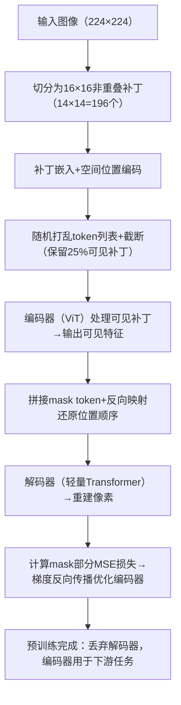
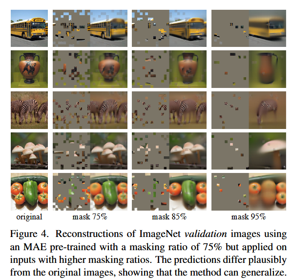
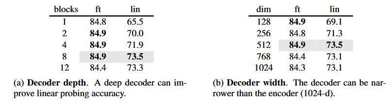
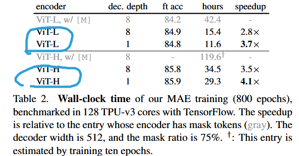

# [论文解读] Masked Autoencoders Are Scalable Vision Learners（MAE）​
论文地址：<arXiv:2111.06377v3>   
核心作者：Kaiming He（FAIR）等  
领域：计算机视觉-自监督学习  
关键词：掩码自编码、Vision Transformer、可扩展预训练  

[论文核心价值与贡献](#1论文核心价值与贡献)  

[研究背景与核心问题](#2研究背景与核心问题)

[MAE 架构与设计](#3MAE架构与设计)

[实验结果解析](#4实验结果)

[创新方法](#创新方法)

[知识点](#知识点)

# 1.论文核心价值与贡献
## 1.1核心定义
1. 首个证明“掩码自编码（MAE）在视觉领域可媲美NLP自监督效果”的工作，打破“视觉自监督依赖对比学习”的固有范式；   
2. 提出极简、高效、可扩展的视觉预训练框架，无需复杂数据增强或额外任务设计，仅通过“掩码-重建”即可学到高质量语义特征。

## 1.2三大核心贡献

1. 揭示视觉与语言掩码自编码的本质差异,总共三个[架构适配性，信息密度，解码器作用](##21行业痛点)：
2. 创新非对称编码器-解码器架构：编码器仅处理可见补丁（无mask token），轻量解码器负责重建，训练效率提升3-4倍；
3. 验证视觉自监督的“缩放增益”：模型容量（ViT-B→L→H）和训练时长提升时，性能持续增长，ViT-Huge在ImageNet-1K达87.8%准确率（仅用IN1K数据）。

# 2.研究背景与核心问题
## 2.1行业痛点
1. 深度学习模型对大规模标注数据需求强烈
2. NLP领域通过掩码自编码（BERT/GPT）成功解决数据依赖问题，但视觉领域掩码自编码进展滞后——核心症结是视觉与语言存在三大差异：

| 差异维度   | 语言领域                 | 视觉领域                             |
|------------|----------------------|--------------------------------------|
| 架构适配性 | Transformer 天然适配序列编码 | 过去以卷积网络为主，难以整合 mask token / 位置编码 |
| 信息密度   | 高语义浓缩（每个词的信息含量很大）    | 强空间冗余（相邻像素信息重复）       |
| 解码器作用 | 预测高语义 token（如“小狗”）   | 重建低语义像素（需空间结构建模）     |
## 2.2核心研究问题和解决方案
需要解决2.1里面的三个差异，才能让掩码自编码在视觉领域发挥作用，具体问题包括：
1. 对于架构方面，已经出现了ViT（Vision Transformer）的出现解决了架构障碍，为视觉 MAE 提供了基础
2. 因为自然信号存在大量空间冗余（缺失补丁可通过相邻区域低层次推断，无需理解物体 / 场景），导致模型学习到的语义特征有限，如何设计掩码策略以提升学习效率？
解决方法是通过大量掩码来解决，后续也有实验证明高掩码率（75%）效果更好
3. 解码层的作用在语言和视觉领域差异较大，不能将语言领域的设计直接套用到视觉领域，对于视觉用编码器-解码器架构进行改进，且解码器不参与最终下游任务，最重要的是减小解码器规模不会影响编码器学习到的语义特征

# 3.MAE架构与设计
整体架构图：

整体流程图：

原文是从五个方面讲解模型结构：Masking，encoder，decoder，Reconstruction target，Simple implementation.
解读将从三个方面详细讲解：
## 3，1输入处理与掩码策略
图像分块与嵌入：沿用ViT的基础输入处理逻辑  
  第一步：将输入图像（如224×224像素）切分为固定大小的非重叠补丁（如16×16像素/补丁），得到补丁序列（224/16=14，即14×14=196个补丁）；  
  第二步：通过线性嵌入层（LinearProjection），将每个16×16的像素块（维度=16×16×3=768）映射为固定维度的向量（如768维，称为“补丁嵌入”）；  
  第三步：为嵌入向量添加位置编码（Position Embedding）——因为Transformer本身无位置感知能力，位置编码需与补丁嵌入维度一致，叠加后作为Transformer的输入。  
关键设计：高比例随机掩码（证明空间的冗余性特别强）  
  掩码规则：对196个补丁序列进行“随机均匀掩码”，掩码比例固定为75%（即仅保留49个可见补丁，遮罩147个补丁）；  
  为什么是75%？——呼应引言“视觉空间冗余”（后续实验证明75%最优）：低比例掩码（如20%）时，模型可通过相邻补丁的低层次像素规律推断缺失内容；
75%的高比例掩码会大幅减少冗余，迫使模型必须学习“物体/场景的整体结构关系”（如“狗的头部应在身体上方”“天空在图像顶部”）才能完成重建，从而诱导语义级特征学习；  
  掩码处理：被掩码的补丁直接从编码器输入中移除，仅将可见补丁的嵌入向量+位置编码输入编码器——这是“训练效率提升”的关键，<a href="#target-sentence-01">计算量减少4倍</a>。

## 3.2非对称编码器-解码器架构
需要明确需求，即“编码器需学到高质量语义特征用于下游任务，解码器仅为重建服务，且不参与下游任务”，基于此设计非对称架构：  
- 编码器（Encoder）：轻量、高效，聚焦可见信息  
  核心结构：基于ViT的Transformer编码器（由多层Multi-Head Self-Attention + MLP组成）；  
  输入：仅接收“可见补丁的嵌入向量+位置编码”（无掩码标记，避免引入冗余计算， <a href="#source-sentence">且因为编码器的参数量大，所以如果减少输入将大大加快训练速度</a>）；   
  核心目标：[学习可见补丁的全局语义关联，输出高维度的“可见补丁 latent 特征”](#图片语义冗余)；  
  设计优势：对比相关工作中“编码器处理全部补丁（含掩码）”的对称架构，本设计将计算量集中在有效信息上，训练效率提升3倍以上，且内存消耗大幅降低（可训练更大容量的ViT模型，如ViT-Huge）。  
- 解码器（Decoder）：轻量、专用，仅负责重建  
  核心定位：解码器是“重建任务的专用组件”，不参与下游任务（如分类、检测）的特征提取，因此设计为“轻量结构”以减少冗余计算；  
  输入构建：将编码器输出的“可见补丁 latent 特征”，与“掩码补丁的标记（mask tokens）”拼接——mask tokens是固定维度的可学习参数，用于占位被掩码的位置，同时保留原始的位置编码（确保空间结构信息不丢失）；  
  核心结构：比编码器更浅、更小的Transformer解码器；  
  输出目标：通过解码器最后一层的线性层，将每个补丁的特征映射回“原始补丁大小的像素值”，实现“像素级重建”。  

- 非对称架构的逻辑闭环：编码器负责“学习高质量语义特征”，解码器负责“将语义特征映射为像素”——两者分工明确，既解决了NLP解码器极简但视觉需重建像素的差异（引言核心问题），又避免了对称架构的效率低下（相关工作不足）。  

## 3.3预训练与微调策略
- 预训练阶段
  优化目标：仅优化“掩码补丁的重建损失”（MSE损失，即重建像素与原始像素的均方误差），不计算可见补丁的损失——因为可见补丁无需重建，聚焦掩码区域可强化模型的推断能力；  
  训练细节：采用标准的随机梯度下降（SGD），批量大小、学习率等超参数与ViT有监督训练一致，确保可复现性。  
- 微调阶段（核心简化设计）
  核心操作：直接丢弃解码器，仅使用编码器作为下游任务的特征提取器；    
  微调方式：在编码器的输出特征上，添加一个简单的分类头（如单层MLP或线性层），针对下游任务（如ImageNet分类）进行有监督微调；   
  设计优势：解码器不参与微调，大幅降低下游任务的部署成本，同时证明了<a name="图片语义冗余">编码器学到的特征已足够支撑语义级任务</a>。  

# 4实验结果
## 4.1消融实验
### 1.掩码比例对性能的影响

- 如上图：横坐标：掩码比例（10%-90%），纵坐标：ImageNet-1K 准确率（%）； 上半图（fine-tuning）：40%-80% 掩码比例均表现优异，
75% 时达最优（84.9%），显著高于低比例（10% 仅 83.2%）； 下半图（linear probing）：准确率随掩码比例上升持续增长，75% 达峰值（73.5%），
低比例（10%）仅 54.6%，差距近 20%；
- 高比例掩码（75%）是诱导语义学习的核心：低比例时模型可通过相邻像素推断，高比例时必须依赖物体 / 场景的整体结构理解；
- 微调对掩码比例更鲁棒（40%-80% 均可），但线性探测对比例敏感，说明高比例掩码能学到更本质的特征。
### 2.解码器规模对性能的影响

- 解码器无需复杂：1 层解码器即可支撑微调任务（84.8%），说明 “编码器学到的特征已足够强”；
- 解码器深度影响线性探测：足够深的解码器（8 层）能让 latent 特征更抽象，适配线性分类器；
- 默认设计（8 层 ×512 维）仅占 ViT-L 编码器计算量的 9%，验证非对称架构的效率优势。
### 3.掩码标记（mask token）的插入位置影响

- 编码器不含 mask token 时，性能（尤其是线性探测）提升 14%，且计算量减少 3.3 倍；
- 原因：避免编码器依赖 “掩码标记”，强制其聚焦可见 patch 的语义关联，学到的特征更纯粹。
### 4.重建目标对性能的影响
  
对应原文第三章倒数第二段
- 归一化像素是最优目标：比原始像素提升 0.5%，比离散 token 更优（且无需额外 dVAE 预训练）；
- 高频率特征重要：PCA 降维丢失高频率细节，导致性能下降，说明 MAE 需要像素级的精细结构信息。

### 5.掩码采样策略
  
随机采样（默认）最优（84.9%），块采样（75% 比例）准确率仅 82.8%（任务过难），网格采样（规律保留）准确率 84.0%（任务过易），证明 “随机高比例掩码” 能平衡任务难度与语义学习。

## 4.2模型可扩展性：模型容量与训练时长
### 4.2.1模型容量扩展

 - MAE 性能全面超越基准：ViT-Huge 达 86.9%（224 尺寸），448 尺寸达 87.8%，刷新 ImageNet-1K 单模型最优（仅用 IN1K 数据）；
 - 缩放增益显著：ViT-B→ViT-L→ViT-H，准确率持续提升（+2.3%+1.0%），而有监督训练的缩放增益微弱（+0.3%+0.5%），证明 MAE 解决了有监督训练的过拟合问题。

### 4.2.2训练时长扩展
  
MAE 的预训练特征具有 “持续学习能力”，延长训练可进一步挖掘语义信息（对比 MoCo v3 300 epochs 即饱和）。

## 4.3训练效率验证非对称架构的优势

- 效率提升显著：MAE 训练速度是对称架构的 2.8-4.1 倍，内存消耗降低 50% 以上；
- 性能与效率双赢：加速的同时，准确率反而更高（84.9% vs 84.2%），证明非对称架构的设计合理性。
- 其实完全可证明对于视觉领域，掩码自编码的核心在于“高比例掩码”和“非对称架构”，这两点才是让模型学到高质量语义特征的关键。

# 创新方法
- 非对称编码器 - 解码器架构：编码器仅处理可见补丁（无 mask token），聚焦语义特征学习；轻量解码器（计算量仅为编码器 9%）接收可见特征 + mask token（带位置编码），负责像素重建，微调时丢弃解码器，大幅提升效率。
- 高比例随机掩码策略：掩码比例 75%（保留 25% 补丁），通过 “随机打乱 token 列表→截断保留→反向映射还原顺序” 的完整链路（避免位置信息丢失），消除空间冗余，强制模型学习全局语义关联。
- 归一化像素重建目标：逐补丁计算均值和标准差进行像素归一化，消除光照 / 对比度干扰，聚焦结构特征，提升表征质量。

# 问题
- 为什么对于掩码部分的内容要在解码器中进行重建，而不是直接在编码器中进行预测？
- 论文中 75% 的高比例随机掩码被验证为最优，而低比例（如 10%）和超比例（如 90%）均表现不佳，这是什么原因，并说明为何语言领域的 BERT 仅需 15% 的掩码比例就能实现有效学习？

# 知识点
## 信息密度
  1. 语言的高信息密度：每个词都是 “关键信息节点”  
    人类语言是 “语义压缩后的信号”，比如句子 “小狗在草地上追蝴蝶”：
    每个词都承载独特语义（小狗 = 主体、追 = 动作、蝴蝶 = 对象），少任何一个词（如掩码 “小狗”），句子语义就不完整，模型必须通过上下文（草地、追蝴蝶）推断 “谁在追”—— 这个过程会迫使模型学习 “主体 - 动作 - 对象” 的语义关联，也就是语言理解的核心。   
    本质：语言的信息是 “非冗余的”，少量缺失就会制造 “语义缺口”，模型必须通过深层理解填补，这也是 NLP 掩码任务能诱导复杂理解的原因。
  2. 视觉的空间冗余：大量信息是 “重复且可推断的”，单块信息无独立语义  
    视觉自然信号（比如一张 “小狗追蝴蝶” 的图像）的信息分布是 “分散且重复” 的：  
    比如图像中 “草地” 区域，相邻的像素都是绿色，缺失一块草地补丁（掩码），模型不用理解 “这是草地”，
     只要看周围的绿色像素，就能直接推断出缺失部分是绿色 —— 这个过程只需要低层次的像素规律，不需要任何语义理解。  
    本质：视觉的空间冗余让 “少量掩码” 无法制造 “理解缺口”，模型靠 “猜像素” 就能完成任务，达不到预训练需要的 “诱导深层视觉理解” 的目标。这也是论文后续提出 “高比例掩码（如 75%）” 的核心原因：只有遮掉大部分重复信息，剩下的补丁才需要模型通过 “理解物体 / 场景整体关系” 来推断，比如遮掉小狗的头部和蝴蝶，模型必须知道 “小狗的头部应该在身体上方”“蝴蝶会在草地上方飞” 才能重建，这就逼出了语义级的理解。
