# [论文解读] Masked Autoencoders Are Scalable Vision Learners（MAE）​
论文地址：<https://arxiv.org/abs/2304.02643>   
核心作者：Alexander Kirillov等  
领域：图像分割与计算机视觉
目录：


# 1.论文核心概览
# 1.1 研究背景与定位​
1. 领域痛点​
NLP领域的基础模型（如GPT系列）通过web-scale数据预训练与Prompt工程，实现了强零样本/少样本泛化能力，彻底重塑了自然语言处理领域；但计算机视觉领域的基础模型探索仍局限于图文对齐（如CLIP、ALIGN）等有限方向，核心的图像分割任务长期面临三大核心痛点：

- 任务专用：传统分割方法需针对特定细分任务（语义分割、实例分割等）单独设计模型，无法适配未见过的任务与数据分布；

- 数据稀缺：分割掩码标注成本极高（远高于边界框标注），缺乏web-scale规模的高质量、多样化数据集支撑大规模预训练；

- 泛化薄弱：模型性能高度依赖训练数据分布，对新场景（如水下、显微图像）和新任务的适配能力极差。​
研究目标​
2. 构建图像分割领域的通用基础模型，实现三大核心目标：

- 零样本迁移：无需针对特定任务微调，仅通过Prompt工程即可适配多种分割相关任务；

- 灵活交互：支持点、框、文本、掩码等多种形式的Prompt输入，满足不同场景下的使用需求；

- 高效实用：兼顾模型性能与推理效率，支撑交互式标注与大规模自动数据生成。

# 1.2核心思路​
围绕三个关键问题展开“什么任务能支持零样本泛化？”“对应的模型架构是什么？”“什么数据能支撑该任务和模型？”，
并提出 “可提示分割任务 + SAM 模型 + 数据引擎” 的综合解决方案。
- NLP 基础模型借鉴：NLP 通过 “预训练任务（如 next token prediction）+prompt 工程” 实现泛化，为 CV 分割提供了核心思路 —— 设计通用预训练任务，而非任务专用模型。
- CV 现有相关尝试：CLIP、ALIGN 等通过对比学习实现图文模态对齐，可通过 text prompt 实现零样本视觉分类，但仅覆盖图文关联任务，无法解决分割、边缘检测等其他 CV 任务的泛化问题。
- 传统分割方法局限：分割领域包含交互式分割、语义分割、实例分割等多种细分任务，现有方法多为 “单任务优化”，依赖小规模人工标注数据集，泛化能力弱，无法适配新场景和新任务；多任务分割系统也仅能处理固定任务集，无法应对未见过的新任务。

# 2.任务-模型-数据
整体结构
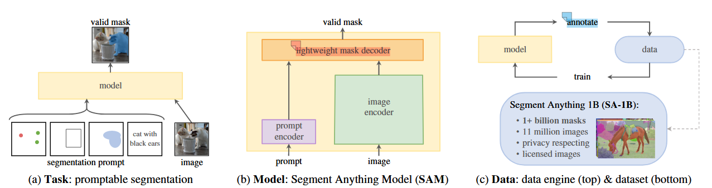
## 2.1可提示分割任务​
设计逻辑：借鉴NLP范式，重构分割任务接口​
传统分割任务的核心问题是“任务与模型强绑定”——语义分割、实例分割等不同任务需单独设计标签体系与模型输出头，导致泛化能力极差。
SAM借鉴NLP领域“Prompt统一任务接口”的思路，从“Prompt 工程” 将 “文本到掩码” ，将所有分割相关需求抽象为“Prompt→掩码”的通用任务形式，核心目标是让模型学习“理解分割线索（Prompt）并输出有效掩码”的通用能力，而非适配特定任务的标注规则。​

这一设计从根源上解决了传统分割的泛化瓶颈：预训练阶段模型只需学习“不同Prompt与掩码的映射关系”，下游任务无需微调，仅通过“Prompt工程”将具体需求转化为模型可理解的Prompt即可完成适配。

- Prompt类型：稀疏和稠密两种输入提示（2.2模型结构图中的mask和点，框，文本）
  1. 稀疏Prompt：不依赖全图像素的关键线索，包括点（前景点/背景点）、边界框、自由文本（如“红色汽车”）。此类Prompt适配交互式分割、快速目标定位等场景，标注成本极低；​
  2. 稠密Prompt：覆盖部分/全图像素的结构化线索，仅包含掩码（如手动画的粗略掩码、前一轮模型输出的掩码）。此类Prompt适配精准分割优化、批量标注修正等场景，提供更细粒度的分割指引。

- 关键约束  
使输入模糊Prompt（如单个前景点对应多个物体、边界框包含多个目标），模型也需输出“有效掩码”（即与真实物体轮廓大致匹配的掩码）。
这一约束是后续数据引擎“全自动标注”的核心前提——若模型仅能处理明确Prompt，则无法应对全自动阶段的“网格点Prompt”（无人工干预的模糊线索）。

## 2.2SAM模型架构
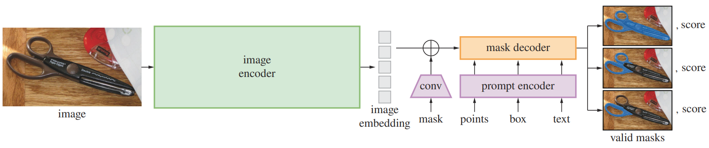
整体架构分为三大核心组件：图像编码器（Image Encoder）、Prompt编码器（Prompt Encoder）、轻量掩码解码器（Mask Decoder），
三组件协同实现“Prompt理解→特征融合→掩码生成”的完整流程。
### 2.2.1 图像编码器
原文中是采用图像编码器：MAE预训练ViT（MAE训练出来的模型能够提取出更加深层特征）：

- 核心作用：将输入图像（默认1024×1024分辨率）转化为高维、强表达的图像嵌入（64×64×256），捕捉图像的边缘、轮廓、语义等关键特征。​  

- 基础架构：采用Vision Transformer（ViT），提供三种规模选择（ViT-H/L/B），其中ViT-H为默认最优配置（636M参数）；​

- 预训练策略：基于MAE（Masked Autoencoder）预训练，而非随机初始化。MAE预训练让ViT具备更强的通用视觉特征提取能力，尤其擅长捕捉物体的整体结构，为分割任务奠定基础；​

- 关键设计：
  1. 高分辨率适配：通过重叠切片嵌入（Overlapping Patch Embedding）提升对小物体、细结构的特征捕捉能力；​

  2. 一次编码复用：图像编码器仅运行一次，生成的64×64×256嵌入可支撑后续任意Prompt的推理，是“实时响应”的核心保障（浏览器端单Prompt推理≈50ms，主要耗时在解码器）；​

  3. 微调策略：预训练后在SA-1B数据集上微调，让特征提取更适配分割任务（如强化边缘特征）。

### 2.2.2Prompt编码器
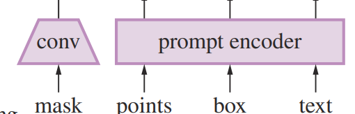
- 稀疏Prompt编码（点/框/文本）
  1. 点/框Prompt编码：
     - 位置编码：采用Fourier特征编码（固定数学变换，非学习得来）。先将像素坐标（x,y）归一化到[-1,1]区间，
     再通过不同频率的正弦/余弦函数编码，生成高维向量后通过线性层降维至256维；​

     - 类型嵌入：可学习的256维向量（通过反向传播优化），用于区分Prompt的语义类型。例如点Prompt有“前景点嵌入”“背景点嵌入”，框Prompt有“左上角顶点嵌入”“右下角顶点嵌入”；​

     - 编码融合：将位置编码与类型嵌入按元素相加，得到最终的256维稀疏Prompt嵌入。
  2. 文本Prompt编码：  
     - 复用CLIP的ViT-L/14@336px文本编码器，将自由文本转化为768维文本嵌入；​

     - 通过ℓ²归一化将768维向量压缩到256维，确保与图像嵌入、其他Prompt嵌入维度一致（依赖CLIP的图文对齐特性，实现文本与视觉特征的匹配）。
- 稠密Prompt编码（mask)  
掩码是像素级稠密输入，无法直接用“位置+类型”编码，需通过卷积降维实现空间对齐：

  - 预处理：将输入掩码（与图像同分辨率，如1024×1024）下采样到256×256（图像的1/4）；​

  - 卷积降维：通过两层2×2卷积（stride=2，步幅2实现下采样），依次将通道数从1（单通道掩码）→4→16，每一层后接GELU激活和层归一化；​

  - 最终映射：用1×1卷积将16通道特征映射为256通道，得到64×64×256的稠密嵌入（与图像嵌入分辨率、通道数完全一致，可直接融合）；​

  - 无掩码适配：若用户未输入掩码，自动添加一个256维可学习的“无掩码嵌入”，与图像嵌入按元素相加，保证编码流程统一性。
### 2.2.3轻量掩码解码器
对应原文的附录A部分详细讲解  
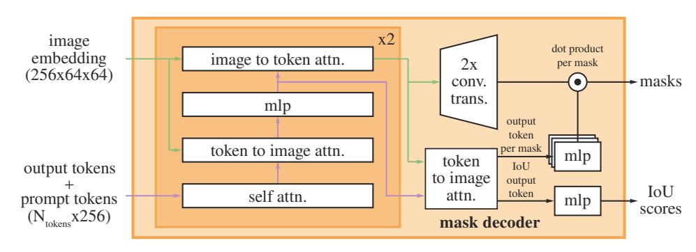
- 核心作用：融合图像嵌入与Prompt嵌入，生成与输入图像同分辨率（1024×1024）的二值掩码，同时解决模糊Prompt的歧义问题。“特征融合→定向强化→双任务输出” 。
1. 输入端 
    - 图像嵌入：来自图像编码器的64×64×256图像嵌入；​
    - Prompt嵌入：将所有稀疏Prompt嵌入（点/框/文本）与稠密Prompt嵌入（掩码）按序连接，形成N×256的Prompt嵌入序列（N为Prompt总数）；​
    - 可学习掩码查询：4个可学习Output Token（3个用于生成掩码，1个用于预测IoU置信度）。
      - 关键补充：额外插入 4 个 Learned Output Token（3 个用于生成 mask，1 个用于预测 IoU），这些 token 是 “空载体”，会在解码过程中逐步吸收图像和 Prompt 的特征，最终转化为输出。
2. 融合层  
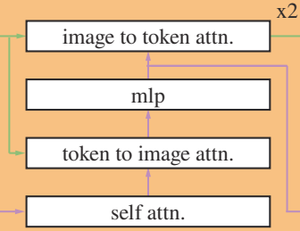
    主体是两层改进型Transformer解码器块，每一层都在做 “Prompt 与图像特征的双向交互”，但是顺序是不一样的：
    - 第一层：Prompt Self-Attention：让 Prompt Tokens 之间互相交流（比如 “前景点” 和 “框” 的位置关联）
    - 第二层：Token→Image Cross-Attention：让 Prompt Tokens 主动查询图像特征（比如 “前景点” 引导模型聚焦图像中该位置的物体），
   以Prompt Token为查询（Q），图像嵌入为键（K）/值（V），引导模型聚焦Prompt对应的图像区域；
   - 第三层：通过两层MLP（隐藏层2048维）对Prompt Token特征进行非线性变换，增强表达能力；
   - 第四层：图像→Prompt交叉注意力（Image-to-Token Cross-Attention）：以图像嵌入为查询（Q），
   Prompt Token为键（K）/值（V），用图像上下文修正Prompt的语义偏差（如修正文本Prompt的歧义）。
   - 融合层的核心作用就是生成一个“融合后的Prompt特征”，包含了Prompt与图像的双向信息交互，能够更准确地指导掩码生成。
3. 输出端
    这里存在定向强化：额外一次 Token→Image Attn，通过融合层后得到的特征大小是属于图像层，所以相当于输出的是一张图像特征图，
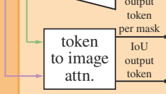
    然后可以取用由mlp输出的 4 个 Output Token（3 个 mask token + 1 个 IoU token）再次查询上采样后的 Image Embedding，强化 “输出 token 与图像局部特征” 的关联；
    后续总体是两条路径(对应上述输入的四个可学习Output Token)：  
    1. 掩码生成路径：
         - 图像嵌入上采样：通过两层2×2转置卷积（stride=2），将64×64的融合特征逐步上采样到256×256（对应输入图像的1/4）；
         - 动态线性分类器：将两层解码器块更新后的3个掩码专用Output Token，通过3层MLP映射为256维向量，与上采样后的图像嵌入做“空间逐点乘积”，
       经sigmoid激活得到3个256×256的概率图，再上采样到1024×1024分辨率，阈值0.5二值化得到最终掩码；
    2. IoU置信度路径：
         - 1个IoU专用Output Token通过独立线性层，输出3个掩码对应的预估IoU（与真实掩码的匹配度），用于筛选最优掩码。

4. 歧义处理方案  
   为解决 “模糊 Prompt 对应多个物体” 的问题，SAM 设计了针对性方案：
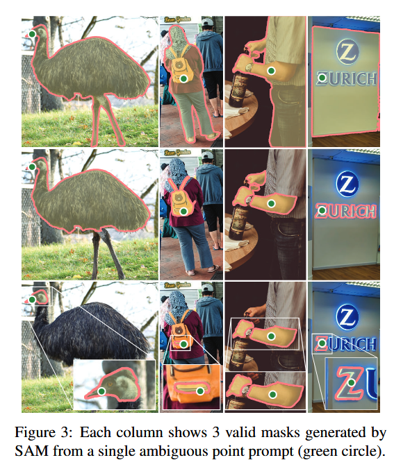
      - 多 mask 输出：默认预测 3 个掩码，分别对应 “整体物体、物体部分、物体子部分”（覆盖绝大多数嵌套场景）；
      - 训练策略：计算 3 个掩码与真实掩码的损失，仅对损失最小的掩码反向传播（即仅优化最优结果），避免模型学习平均化特征；
      - 置信度评分：额外设计一个 IoU 预测头，对每个输出掩码打分（估计与真实目标的 IoU），方便下游选择最优掩码；
      - 特殊情况：若输入多个 Prompt（如点 + 框），歧义性降低，模型自动输出 1 个掩码（通过第 4 个 output token 实现），减少冗余。
5. 损失函数
    1. 掩码预测损失：focal loss（20）+ dice loss（1）的线性组合，平衡正负样本（前景像素少、背景像素多），提升小目标掩码预测精度；
    2. IoU 预测损失：MSE 损失（预测 IoU 与真实 IoU 的差异），权重 1.0，确保置信度评分的准确性。
    
# 3数据引擎
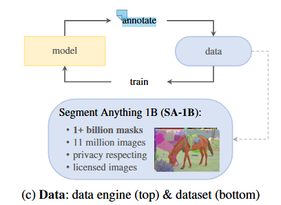
整体分为三阶段递进流程，每阶段均伴随模型迭代优化
1. 第一阶段：辅助手动标注（Assisted-manual stage）—— 积累初始高质量数据​

    阶段目标：解决“初始高质量数据稀缺”问题，用模型辅助标注提升效率，积累第一批精准掩码；​

    具体操作：  
> 1. 初始模型：用COCO等公共分割数据集训练基础版SAM，具备初步交互式分割能力；  
> 2. 标注工具：基于浏览器的交互式工具，标注者仅需点击前景点/背景点，SAM实时生成掩码，支持画笔/橡皮擦微调；​  
> 3. 标注规则：不限制语义类别，覆盖“物体（things）”和“场景元素（stuff）”，优先标注显著物体，单个掩码标注超过30秒则跳过（保证效率）；​  
> 4. 模型迭代：随数据积累，用新数据重新训练SAM（共迭代6次），图像编码器从ViT-B升级到ViT-H，标注效率持续提升。

2. 第二阶段：半自动标注（Semi-automatic stage）—— 补充数据多样性​

    阶段目标：第一阶段标注的多是图像中显著物体，掩码多样性不足（如角落小物体、被遮挡物体缺失），本阶段通过“自动生成+人工补充”提升数据多样性；​

    具体操作：  
>1. 自动生成显著物体掩码：用第一阶段数据训练物体边界框检测器，自动识别图像中的显著物体，再让SAM根据边界框生成初始掩码；​
>2. 人工补充标注：将自动生成的掩码预填充到图像中，标注者仅需标注未被覆盖的非显著物体（如角落小物件、遮挡物体）；​
>3. 模型迭代：定期用“自动+手动”数据重新训练SAM（共迭代5次），提升对非显著物体的分割能力。

3. 第三阶段：全自动标注（Fully automatic stage）—— 大规模生成SA-1B数据集​

    阶段目标：经过前两阶段迭代，SAM已具备“模糊Prompt输出有效掩码”的能力，本阶段完全脱离人工，实现大规模掩码生成；​  
    具体操作（核心：质量控制）：  
>1. 掩码生成：对每张图像，用网格点Prompt生成大量掩码（3个/点）；​
>1. 多轮筛选（确保质量）：​
>1. 置信度筛选：保留预估IoU≥0.88的掩码（确保与物体匹配度）；​
>1. 稳定性筛选：对掩码概率图用0.5±δ阈值二值化，两者IoU≥0.95视为稳定掩码（避免边界模糊）；​
>1. 冗余筛选：NMS（阈值0.7）去除重复掩码；​
>1. 无效筛选：移除覆盖图像面积≥95%的无意义掩码；​
>1. 小物体优化：图像裁剪放大后生成掩码，提升小物体精度。

# 4结果分析
## 4.1单点掩码评估
验证场景 —— 仅输入一个前景点，SAM 能否生成高质量掩码（单点易歧义，最能体现泛化能力）。  
评估方式：① 自动指标 mIoU；② 人类评分（1-10 分，图 9b）；③ “oracle” 评估（从 3 个掩码中选与真实掩码最匹配的，消除歧义影响）。
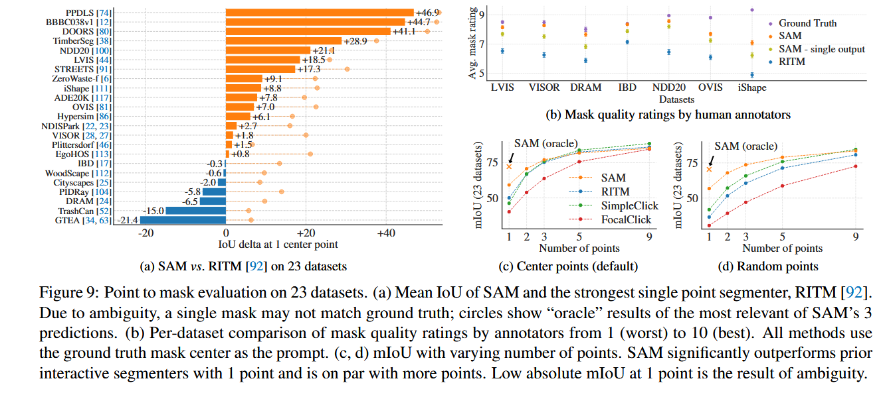  
图 9a：  
- “oracle” 模式下，SAM 在所有数据集上超越 RITM—— 说明 SAM 的低 mIoU 多是 “歧义导致掩码不匹配真实标注”，而非掩码质量差；

图 9b：
- 即使自动指标（mIoU）落后的数据集（如 DRAM、IBD），人类评分仍更高 —— 证明 SAM 的掩码更符合人类视觉判断，而非单纯拟合标注偏见。

图 9c/d
- ① 随点数增加（1→9），各模型差距缩小（任务变简单）；
- ② 随机点采样（图 9d）下，SAM 优势更明显 —— 说明 SAM 对点位不敏感，鲁棒性更强。

## 4.2边缘检测
验证低级别视觉任务 —— 无需训练，仅通过 prompt 工程将 SAM 转化为边缘检测器。
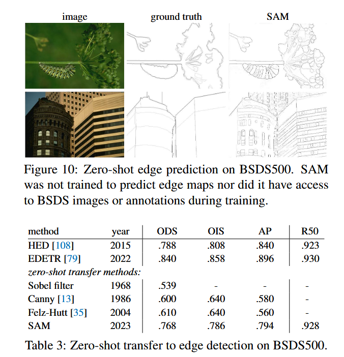  
SAM 生成的边缘与真实标注对齐度高，且能捕捉到人工未标注的细结构边缘（如背景纹理边缘），说明其边缘检测能力具有 “超标注” 潜力。

## 4.3目标提议
验证中级别视觉任务 —— 生成 “可能包含物体的候选区域”（目标提议是检测 / 分割的基础步骤）。
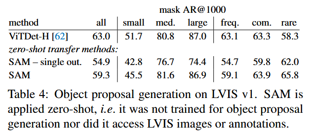  
SAM 整体 AR=59.3，略低于 ViTDet-H（63.0），但在关键维度超越：  
① 中大型物体（AR=81.6 vs 80.8）、稀有类别（AR=65.8 vs 58.3）—— 说明 SAM 无类别偏见，适配开放世界场景；  
② 单输出 SAM（无歧义处理）性能显著下降（AR=54.9）—— 证明多掩码输出对提升召回率至关重要；  
ViTDet-H 仅在小物体、频繁类别上占优 —— 因它学习了 LVIS 的标注偏见（如小物体标注密度高），而 SAM 是零样本适配，无偏见干扰。

## 4.4实例分割
验证高级别视觉任务 —— 将 SAM 作为分割模块，与目标检测器结合实现实例分割。
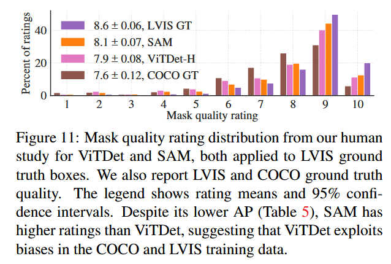  
① SAM 的掩码评分（8.1 分）高于 ViTDet-H（7.9 分），甚至接近 LVIS 真实掩码（8.6 分）；  
② 定性结果显示，SAM 的掩码边界更清晰（如图 16 中盘子的模态掩码，ViTDet-H 的掩码边界模糊）—— 因 SAM 未被数据集标注规则（如 LVIS 掩码无孔）束缚，生成更符合视觉直觉的掩码。

## 4.5文本到掩码
验证跨模态能力 —— 用自由文本作为 prompt，SAM 能否分割对应物体（证明 prompt 工程的灵活性）。
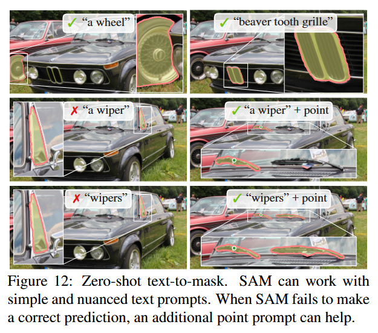  
① 简单文本（“a wheel”）：直接输出对应物体掩码；  
② 复杂文本（“beaver tooth grille”）：能理解细粒度语义，分割特定部件；  
局限性：纯文本 prompt 可能存在歧义（如 “wipers” 未明确指哪类雨刷），补充一个点 prompt 即可修正 —— 证明多 prompt 组合能提升鲁棒性。

## 4.6消融实验
验证 “数据引擎阶段”“数据规模”“模型规模” 对 SAM 性能的影响，找到实用化最优配置。
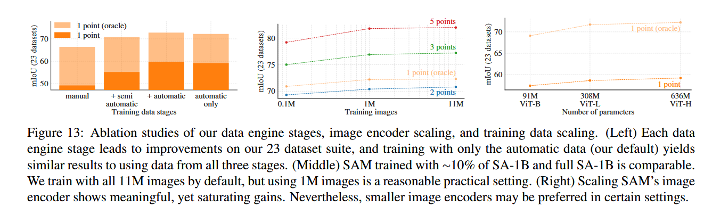
- 仅用自动生成的数据训练，性能仅比 “全阶段数据” 低∼0.5 mIoU—— 说明自动生成的掩码质量足够可靠，可简化训练流程。  
- M 图像（10% 全量）性能接近 11M 全量 —— 说明 100M 级掩码（1M 图像 ×100 掩码 / 图）已能支撑强泛化，无需追求极致数据量。  
- ViT-H（636M 参数）优于 ViT-B（91M），但 ViT-L（308M）与 ViT-H 差距极小 —— 说明模型规模存在边际效益递减，中小规模编码器（ViT-L）可平衡性能与效率。


# 创新点
1. 任务范式创新：统一可提示分割的通用任务接口
    1. 传统图像分割任务（语义 / 实例 / 交互式分割等）存在 “任务 - 模型强绑定” 问题，每个细分任务需单独设计标签体系与输出头，泛化能力极差。SAM 的核心创新在于借鉴 NLP 的 Prompt 工程范式，重构分割任务的通用接口：
    2. 将所有分割需求抽象为 “Prompt→掩码” 的单一任务形式，覆盖稀疏 Prompt（点 / 框 / 文本）和稠密 Prompt（掩码）两类输入，让模型学习 “理解分割线索并输出有效掩码” 的通用能力，而非适配特定任务的标注规则；
    3. 从根源上解决泛化瓶颈：预训练阶段仅学习 Prompt 与掩码的映射关系，下游任务无需微调，仅通过 Prompt 工程即可适配，真正实现分割任务的 “零样本迁移”。
2. 模型架构创新：解耦式三组件设计 + 差异化 Prompt 编码
    1. 解耦式三组件架构：将图像编码、Prompt 编码、掩码解码解耦，图像编码器仅需一次运行生成高维嵌入，即可支撑任意 Prompt 的实时推理，解决传统分割模型 “一次输入一次编码” 的效率问题；
    2. 差异化 Prompt 编码：针对稀疏（点 / 框 / 文本）和稠密（掩码）Prompt 的特性设计不同编码策略
3. 数据引擎创新
    1. 从 “人工标注为主” 逐步过渡到 “完全无人工干预”，通过模型迭代优化持续提升标注效率与数据多样性；
    2. 验证了 “自动生成掩码” 的可靠性：仅用自动数据训练的模型性能仅比全阶段数据低≈0.5 mIoU，证明大规模自动标注可替代部分人工标注。

# 问题

- SAM 的 “多掩码输出” 设计（默认 3 个掩码）与数据引擎的 “全自动标注阶段” 存在强绑定关系，请解释：该设计为何是全自动标注能实现的核心前提？若改为单掩码输出，全自动标注会面临什么不可解决的问题？
- SAM 的损失函数采用 “focal loss（20）+ dice loss（1）+ IoU 预测 MSE 损失（1.0）” 的三重组合，请分析：三者分别解决分割任务的什么独特痛点？若移除其中任意一个，会对模型性能产生哪些具体影响？


# 知识点

## 一、焦点损失（Focal Loss）

### 1. 核心思想
> **降低易分类样本的权重，聚焦于难分类样本**  
> 解决目标检测中**前景-背景极度不平衡**（如1:1000）的问题

### 2. 数学公式
$$
FL(p_t) = -\alpha_t (1 - p_t)^\gamma \log(p_t)
$$
- $p_t$：模型预测的当前样本属于目标类别的概率
- $\alpha_t$：平衡正负样本的权重因子（通常 $\alpha=0.25$）
- $\gamma$：聚焦参数（调节易难样本权重，通常 $\gamma=2$）

### 3. 工作原理
| 情况                | $p_t$ 值 | 调制因子 $(1-p_t)^\gamma$ | 损失权重 |
|---------------------|-----------|-----------------------------|----------|
| **前景易分样本**    | ~1.0      | ~0.0001 ($\gamma=2$)       | 极低     |
| **前景难分样本**    | ~0.1      | ~0.81                       | 较高     |
| **背景易分样本**    | ~0.0      | ~0.0001                     | 极低     |
| **背景难分样本**    | ~0.9      | ~0.01                       | 较高     |

> 📌 **关键**：易分样本（高置信度）的损失被**大幅抑制**，难分样本（低置信度）的损失被**保留**。

### 4. 实例分析（目标检测场景）
**场景**：检测小目标（如汽车），背景占99.9%，目标占0.1%  
**模型预测**：
- 背景区域（易分）：预测概率 $p=0.99$ → 损失权重 $= (1-0.99)^2 = 0.0001$
- 目标区域（难分）：预测概率 $p=0.1$ → 损失权重 $= (1-0.1)^2 = 0.81$

**对比标准交叉熵**：
| 样本类型   | 标准 BCE 损失 | 焦点损失（$\gamma=2$） |
|------------|---------------|------------------------|
| 背景（易分）| $-\log(0.99) \approx 0.01$ | $0.01 \times 0.0001 = 0.000001$ |
| 目标（难分）| $-\log(0.1) \approx 2.3$   | $2.3 \times 0.81 = 1.86$ |

> 💡 **结果**：焦点损失使目标样本的损失权重**提升186倍**，模型更关注难分样本。

---

## 二、骰子损失（Dice Loss）

### 1. 核心思想
> **基于区域重叠率衡量预测质量**  
> 专为**图像分割**设计，解决前景区域（如肿瘤）仅占图像1%的极端不平衡问题

### 2. 数学公式
**骰子系数（Dice Coefficient）**：
$$
\text{Dice} = \frac{2|X \cap Y|}{|X| + |Y|}
$$
**骰子损失**：
$$
L_{dice} = 1 - \text{Dice} = 1 - \frac{2|X \cap Y|}{|X| + |Y|}
$$
- $X$：真实标签（ground truth）
- $Y$：预测结果
- $|X|, |Y|$：区域中前景像素数量

> 💡 **关键**：损失值在[0,1]之间，**值越小表示预测越准确**。

### 3. 工作原理
- **前景区域占比小**（如1%） → $|X|$ 很小
- 标准交叉熵：背景样本主导训练
- **骰子损失**：直接衡量**重叠区域**，自然忽略背景

### 4. 实例分析（医学图像分割）
**真实标签（X）**（肿瘤区域）：
```
[1, 0, 0, 1]
[0, 1, 0, 0]
[0, 0, 1, 0]
[1, 0, 0, 0]
```
**预测结果（Y）**：
```
[1, 0, 0, 0]  # 位置(0,3)预测错误
[0, 1, 0, 0]
[0, 0, 1, 0]
[1, 0, 0, 0]
```

**计算过程**：
- 交集 $|X \cap Y| = 3$（匹配位置：(0,0), (1,1), (2,2), (3,0)中3个正确）
- $|X| = 5$（真实肿瘤像素数）
- $|Y| = 4$（预测肿瘤像素数）
- $\text{Dice} = \frac{2 \times 3}{5 + 4} = \frac{6}{9} = 0.6667$
- $L_{dice} = 1 - 0.6667 = 0.3333$

> 💡 **结果**：损失值0.3333，表示预测与真实重叠率66.7%。

---

## 三、焦点损失 vs 骰子损失：关键对比

| 特性                | 焦点损失                          | 骰子损失                          |
|---------------------|-----------------------------------|-----------------------------------|
| **主要任务**        | 目标检测（分类）                  | 图像分割（像素级预测）            |
| **核心目标**        | 降低易分样本权重                  | 直接优化区域重叠率                |
| **处理不平衡方式**  | 动态调整样本权重                  | 通过重叠率自然平衡                |
| **典型场景**        | RetinaNet（物体检测）             | UNet（医学图像分割）              |
| **公式关键项**      | $(1-p_t)^\gamma$（聚焦难样本）   | $\frac{2|X\cap Y|}{|X|+|Y|}$（重叠率） |
| **参数**            | $\gamma$（聚焦强度），$\alpha$（平衡权重） | $\epsilon$（防除零，通常=1） |
| **输入维度**        | 逐样本（每个样本独立计算）        | 整个分割图（全局计算）            |
