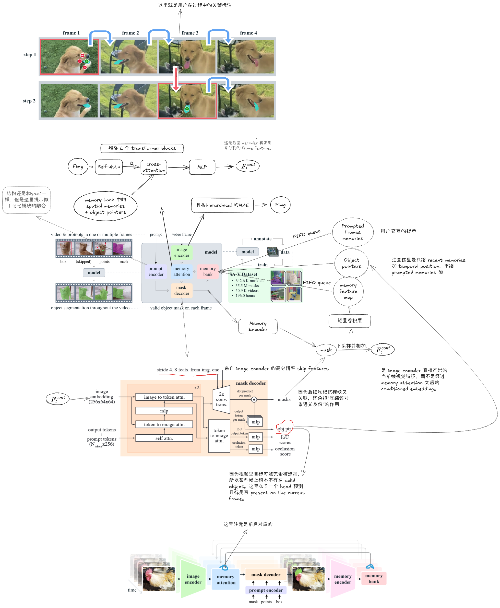
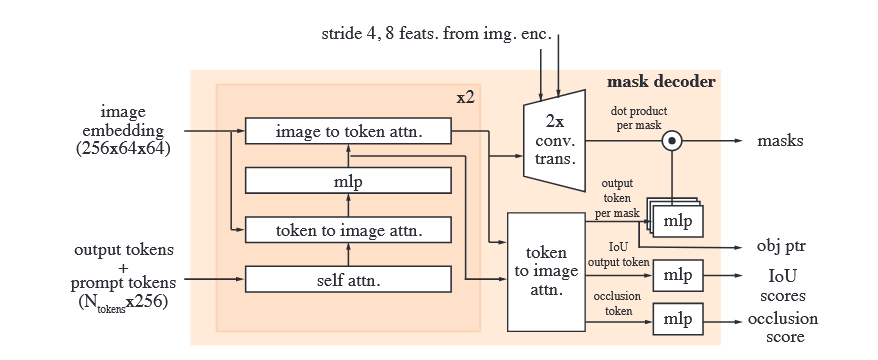
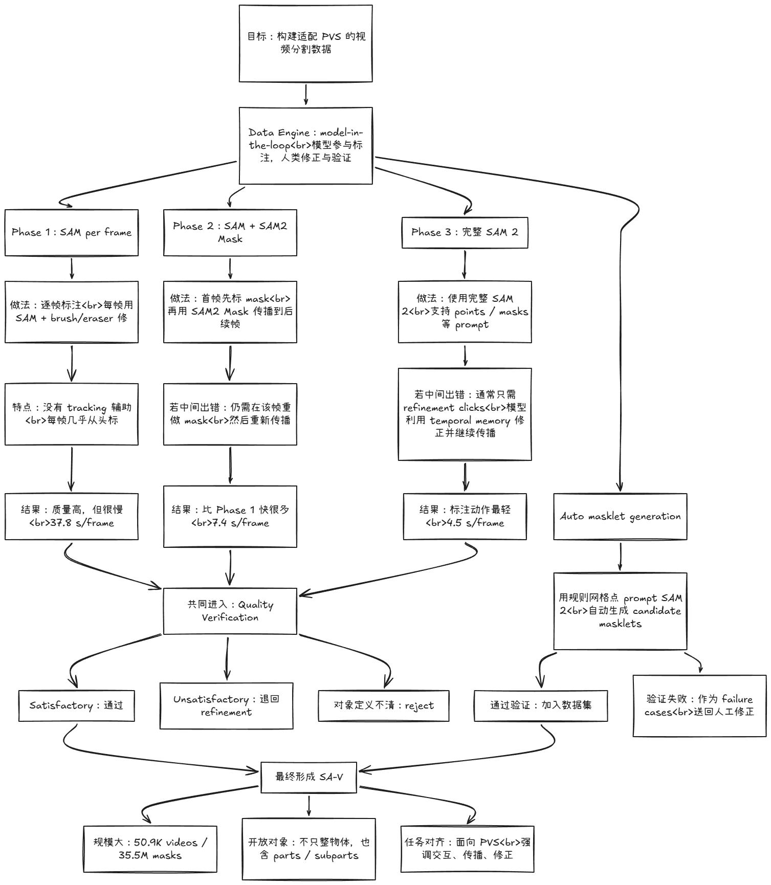
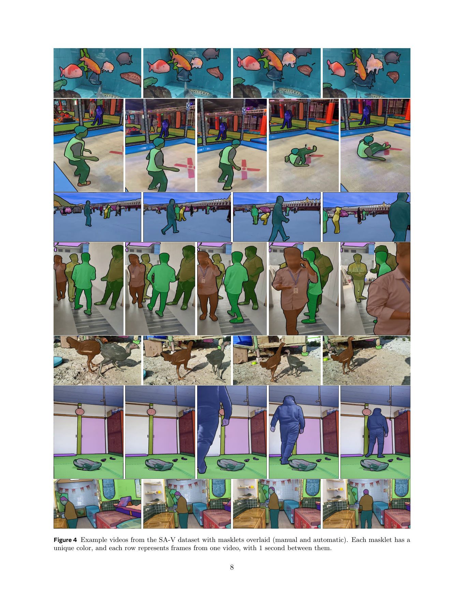
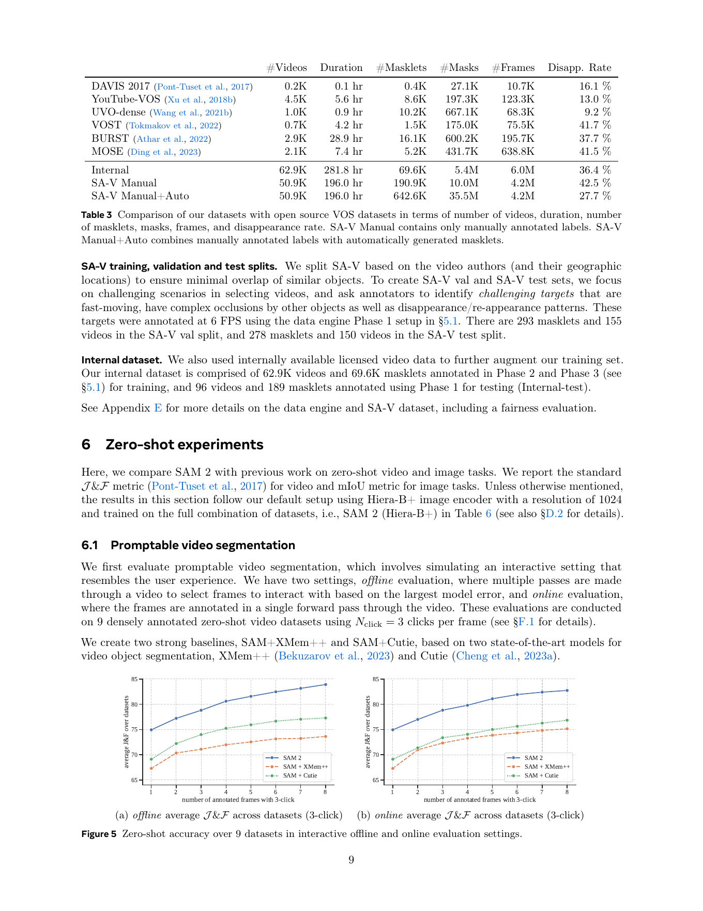

# SAM 2 精读笔记
---  
  
## 1. 一句话先说清：SAM 2 到底做了什么  
  
SAM 2 把 SAM 从“**单图上的 promptable segmentation**”推广到“**图像 + 视频上的 promptable visual segmentation (PVS)**”。  
  
它的核心不是“给 SAM 接一个 tracker”，而是把“**当前帧分割**”和“**历史记忆读取/写入**”做成一个闭环系统：  
  
**image encoder → memory attention → mask decoder → memory encoder → memory bank → 下一帧继续读**  
  
所以 SAM 2 的本质是：  
  
- 能在视频里**维持同一个目标**  
- 能在传播出错后**局部修正而不是重来**  
- 能把用户交互真正纳入视频分割流程  
  
---  
  
## 2. 任务：PVS 比传统 VOS 多了什么  

### 2.1 PVS 是什么  
  
PVS（Promptable Visual Segmentation）的定义是：  
  
- 输入可以是 **point / box / mask** 这类 prompt  
- prompt 可以落在**任意一帧**，不只第一帧  
- 模型要先在当前帧立刻给出分割  
- 然后把该目标传播成跨整段视频的 **masklet**  
- 如果中间错了，用户可以在别的帧继续加 prompt 做 refinement  
  
### 2.2 和传统 semi-supervised VOS 的关系  
  
传统 VOS 常见设定是：  
  
- 第一帧给一个高质量 mask  
- 后续所有帧都只做传播  
- 中途通常没有“真正轻量的交互修正”  
  
所以，**semi-supervised VOS 只是 PVS 的一个特例**：  
  
> 只在第一帧，用一种 prompt（mask）定义目标。  
  
### 2.3 masklet  
  
这个概念一定要准：  
  
- **单帧 mask**：某一帧上目标的分割结果  
- **masklet**：同一个目标在整段视频上的 **spatio-temporal mask 序列**  
  
masklet 不是“会被记住的 mask”，而是**跨时间的目标分割轨迹**。  
  
---  
  
## 3. 模型结构



### 3.1 整体数据流  

对当前时刻 \(t\) 的一帧 \(I_t\)，SAM 2 的主流程是：  
  
1. 当前帧进入 **Image Encoder**  
2. 当前帧特征进入 **Memory Attention**，读取历史 memory  
3. 当前帧的 prompt 进入 **Prompt Encoder**  
4. **Mask Decoder** 同时吃“当前帧条件化特征 + prompt 特征 + 高分辨率 skip 特征”  
5. 输出当前帧 mask、多个候选 mask、predicted IoU、object presence 等  
6. **Memory Encoder** 把“当前预测结果”写成一条新 memory  
7. **Memory Bank** 保存新 memory，下一帧继续被读取  
  
这就是 SAM 2 的闭环：  
  
**读历史 → 做当前帧分割 → 把当前结果写回历史**  
  
---  
  
### 3.2 Image Encoder：负责“看见当前帧”，不负责“认识历史对象”  ，其实就是一个MAE的模型
  
### 作用  
  
Image Encoder 的职责很单纯：  
  
> 生成当前帧的 **unconditioned frame embeddings**。  
  
也就是：只基于当前图像内容提取视觉特征，不包含任何“这个对象是谁、和过去是不是同一个”的信息。  
  
### 为什么叫 unconditioned  
  
因为这一步还没读 memory，也还没融合 prompt。  
  
它回答的是：  
  
- 这一帧有哪些视觉结构？  
- 哪些区域像边界、纹理、部件？  
  
它不回答：  
  
- 当前帧里的这个东西是不是上一帧那个目标？  
  
### 输出  
  
记成 $(F_t^{img})$
这是后续所有模块的视觉底座。  
  
### 一个关键点  
  
SAM 2 的 image encoder 只负责底层视觉，不负责时序一致性。这意味着：  
  
- “对象是谁”不是 image encoder 学的  
- “目标不跟丢”主要不是 image encoder 解决的  
- 真正把视频串起来的是后面的 memory 系统  
  
---  
  
### 3.3 Memory Attention

### 作用  
  
> 用历史 memory 去**条件化**当前帧特征。  
  
所以经过它之后，decoder 吃到的不再只是“当前图像特征”，而是：  
  
> **当前图像特征 + 过去关于该对象的上下文**。  
  
### 输入  
  
- 当前帧的 image features： $(F_t^{img})$
- 来自 memory bank 的历史信息：  
  - recent spatial memories  
  - prompted spatial memories  
  - object pointers  
  
### 内部结构  
  
论文主文给的是 block 级描述：  
  
- 堆叠若干 transformer blocks  
- 每个 block 依次做：  
  - self-attention   先图像自注意力
  - cross-attention 到 memory bank   然后是交叉注意力
  - MLP   感知机
   
可以理解成两步：  
  
1. **先看清这一帧内部结构**  
2. **再去历史中找“这个对象过去是什么样”**  
  
### 输出  
  
得到 conditioned frame embedding，记成 $(F_t^{cond})$。  
  
### 解决问题  
  
不是泛泛的“建模时间”。它真正解决的是：  
  
- 目标外观变化  
- 形变  
- 遮挡后重现  
- 相似干扰物导致的漂移  
- 当前帧信息不足时的身份维持  
  
### 为什么说 SAM 2 不是 “SAM + tracker”  
  
因为在解耦方案里，往往是：  
  
- 先做当前帧分割  
- 再把结果交给 tracker 往后传  
  
而在 SAM 2 里，**当前帧分割本身就是在读过历史记忆之后发生的**。这两者是根本不同的。  
  
---  
  
### 3.4 Prompt Encoder
  
SAM 2 的 Prompt Encoder 基本继承 SAM 1，支持：  
  
- positive / negative clicks  
- boxes  
- masks  
  
### 结构上怎么表示  
  
- sparse prompt（点、框）用位置编码 + 类型 embedding  
- dense prompt（mask）用卷积方式嵌入  
  
### 重要性
  
因为它不再只配对“当前图像”，而是配对：  
  
- 当前图像的 conditioned features  
- 当前对象的历史记忆  
  
所以在 SAM 2 中，prompt 的意义更接近：  
  
> 在已有对象记忆上做初始化或修正  
  
而不是从零开始定义一个对象。  
  
---  
  
### 3.5 Mask Decoder



Mask Decoder 大体沿用了 SAM 风格的 two-way transformer，但在 SAM 2 里承担了更多职责，也可以清楚看到再卷积层那里多了一个高清输入，然后输出多了一个obj ptr

### 输入  
  
1. 来自 memory attention 的 conditioned frame embedding：\(F_t^{cond}\)  
2. 来自 prompt encoder 的 prompt embeddings  
3. 来自 image encoder 的高分辨率 skip 特征  
  
### 为什么高分辨率特征绕过 memory attention  
原因不是“信息太多”，而是**功能分工**：  
  
- **memory attention** 负责时序/对象级语义一致性  
- **high-res skip** 负责边界细节恢复  
  
也就是说：  
  
- 低分辨率路由管“这个目标是谁、和过去是否一致”  
- 高分辨率路由管“边界要切得细”  
  
### 输出  
  
Mask Decoder 不是只输出一张 mask，它会输出：  
  
- 当前帧的 segmentation mask  
- 多个 candidate masks（处理模糊 prompt）  
- predicted IoU  
- object presence  
- 供 object pointer 使用的输出 token  
  
### 比 SAM 1 多出来的东西
  
#### 1）处理视频中的模糊性  
  
单个 click 可能对应多个合理 mask。视频里这种歧义会被传播，所以 SAM 2 依然保留了 multiple masks 设计，并用 predicted IoU 选择传播哪个。  
  
#### 2）判断这一帧目标是否存在  
  
这点非常关键。视频里目标可能：  
  
- 被完全遮挡  
- 暂时出画面  
- 模糊得不可见  
  
所以模型不能总是假设“这帧一定有对象”，必须额外预测 object presence。  
  
---  
  
### 3.6 Memory Encoder
  
它负责把当前帧的分割结果，整理成一条可供未来读取的 **spatial memory**。  
  
### 输入  
  
有两个：  
  
1. 当前帧预测的 mask：$(M_t)$  
2. 当前帧的 unconditioned image embedding：$(F_t^{img})$  
  
注意：这里用的是 **unconditioned** embedding，而不是 conditioned embedding。  
  
### 内部三步  
  
1. 对当前输出 mask 做卷积下采样  
2. 与当前帧的 unconditioned image embedding 做逐元素相加  
3. 经过轻量卷积层进行融合  
  
可以写成：  
  
$[\tilde{M}_t = \text{Downsample}(M_t) ]$  
$[  H_t = \tilde{M}_t + F_t^{img}]$  
$[ Mem_t = \text{LightConvFuse}(H_t)  ]$  
  
### 输出  
  
输出的是一条 **spatial memory feature map**，不是 object pointer。  
  
### 为什么不用 conditioned embedding  
  
论文主文没有专门展开论证，但从结构逻辑看，这样做更合理：  
  
- 避免把“已经混入历史记忆的信息”再次反复写回，导致历史污染历史  
- 让每一帧写回的 memory 都仍然锚定在真实当前图像上  
  
你可以把它理解成：  
  
> memory encoder 存的是“这一帧里，这个对象在真实图像上的状态”，而不是“已经被历史混合过多次的中间表示”。  
  
---  
  
### 3.7 Memory Bank

> **按对象维护的时序状态库**  
  
里面保存的不是原始图像，而是三类历史信息：  
  
1. recent memories  
2. prompted memories  
3. object pointers  
  
### 结构  
  
#### A. Recent memories  
  
- 类型：FIFO queue  
- 内容：最近若干帧的 spatial memories  
- 作用：建模短期运动、连续位移、轻微形变  
  
#### B. Prompted memories  
  
- 类型：FIFO queue  
- 内容：被用户 prompt 过的帧的 spatial memories  
- 作用：提供“高质量锚点”  
  
#### C. Object pointers  
  
- 类型：lightweight vectors  
- 来源：mask decoder output tokens  
- 作用：提供更高层的对象语义摘要，帮助身份维持  
  
### recent 和 prompted 要分开存  
- **recent memories** 代表“刚刚发生了什么”  
- **prompted memories** 代表“哪些帧被人明确纠正过，因此更可信”  
  
它们服务的是两种不同需求：  
  
- recent：短时连续性  
- prompted：高质量监督锚点  
  
### 为什么 temporal position 只加给 recent，不加给 prompted  
  
因为 recent memories 的时间差有明确意义，适合表达短期运动。  
  
而 prompted frames：  
  
- 训练信号更稀疏  
- 推理时可能离当前帧很远  
- 甚至可能来自“未来帧”  
  
所以给 prompted memory 强加时序位置，反而不利于泛化。  
  
---  

## 4. 数据引擎



  
> **SAM 2 的数据不是“先找来再训练”，而是“边训练模型，边让模型改变标注方式”。**  
  
---  
  
### 4.1 旧 VOS 数据不够  
  
旧视频分割数据集的问题不是只有“小”，还有：  
  
- 类别范围有限  
- 偏整物体，不够覆盖 parts / subparts  
- 不适合“任意帧交互修正”这种 PVS 目标  
  
所以 SAM 2 不只是需要更多数据，而是需要**更对题的数据**。  
  
---  
  
### 4.2 三阶段数据引擎  
  
#### Phase 1：SAM per frame  
  
- 用 SAM + brush / eraser 逐帧标  
- 没有 tracking 帮助  
- 质量高，但很慢  
- 平均 37.8 s/frame  
  
本质：  
  
> 这是高质量人工基准，但不能规模化。  
  
#### Phase 2：SAM + SAM 2 Mask  
  
- 先在某一帧（通常首帧）用 SAM 画出高质量 mask  
- 把这张 mask 作为 **mask prompt** 输入给 SAM 2 Mask  
- SAM 2 Mask 负责往后传播  
- 如果中途错了，还得在错误帧重新画一张 mask，再继续传播  
  
本质：  
  
> 这是“单帧精确分割 + 视频传播”的组合，还不是完整交互系统。  
  
#### Phase 3：完整 SAM 2  
  
- 支持 points / masks 等 prompt  
- 出错时不必重画整张 mask  
- 通常只要 occasional refinement clicks  
- 模型利用时间记忆把对象修回来并继续传播  
  
本质：  
  
> 标注动作从“重画 mask”变成“点几下修正”。  
  
### 三阶段真正的差别  
- Phase 1：每帧重做  
- Phase 2：传播，但错了要重画  
- Phase 3：传播，错了轻量修正  

---  
  
### 4.3 SA-V 
  
SA-V 不是“更大的 VOS 数据集”，而是为 PVS 设计的数据集。  
  
它的重要性在于：  
  
- 规模大  
- 对象开放  
- 覆盖 parts / subparts  
- 包含大量遮挡、消失、重现、小目标  
- 与 SAM 2 的目标能力高度对齐  
  
> SA-V 不是陪跑的数据集，而是 SAM 2 能力成立的基础条件之一。  
  
---  
  
## 5. Experiments
  
实验部分不要“读很多表”，要抓最能证明核心结论的几个证据。  
  
---  
  
### 5.1 Figure 2



这张图展示的是：  
  
- 第 1 帧用 prompt 选中对象  
- 模型自动传播到后续帧  
- 如果某一帧跟丢了，只需再给一个 prompt，就能恢复对象并继续传播  
  
这张图真正证明的是：  
  
> SAM 2 的修正不是“重启分割”，而是“基于历史对象记忆的恢复”。  
  
这和“解耦的 SAM + tracker”形成了本质区别。  
  
---  
  
### 5.2 Figure 5 / 6.1



这是最关键的量化实验。  
  
设置是：  

- 在多个 densely annotated zero-shot video datasets 上模拟交互视频分割  
- 比较对象是强基线：SAM+XMem++、SAM+Cutie  
- 横轴是“用了多少个带 3-click 的 annotated frames”  
  
结论不是简单的“曲线更高”，而是：  
  
> **SAM 2 用更少的交互帧，就能达到更高的质量。**  
  
这正是 memory 在 PVS 任务上的真正价值：  
  
- 不是只让结果更准一点  
- 而是显著降低交互成本  
  
  
---  
  
## 6. 容易混淆的点  

  
### 误区 1：把 SAM 2 理解成 “SAM + 一个 tracker”  
  
错在：当前帧分割本身已经读了历史，不是分完再追。  
  
### 误区 2：把 masklet 理解成“会被保存的 mask”  
  
错在：masklet 是跨时间的目标分割轨迹，不是 memory 本身。  
  
### 误区 3：把 memory encoder 和 memory bank 混为一谈  
  
- memory encoder：生成一条新 memory  
- memory bank：组织和保存多条 memory  

---

## 7. 代码复现与使用

复现代码放在：

```text
sam/sam2_from_scratch/
```

核心使用流程是：

```bash
cd sam/sam2_from_scratch
python load_official_sam2_weights.py
python test_image_2_from_scratch.py
```

其中 `load_official_sam2_weights.py` 会把 SAM2.1 tiny 的官方 checkpoint 映射到复现结构中，生成：

```text
sam2fs_tiny_partial_official.pth
```

图像测试输出：

```text
result_image_2_fs_overlay.png
result_image_2_fs_mask.png
result_image_2_fs_cutout.png
```

与官方实现的同图对比结果如下：


差异图如下，绿色表示两者一致，红色表示复现结果独有，蓝色表示官方结果独有：


当前同条件测试中，复现结构与官方实现的 mask IoU 为 `0.9994`。

代码模块与论文结构的对应关系：

| 论文模块 | 代码位置 | 对应内容 |
|---|---|---|
| Image Encoder | `sam2fs/hiera.py`、`sam2fs/image_encoder.py` | Hiera backbone 和 FPN neck，生成多尺度图像特征 |
| Prompt Encoder | `sam2fs/prompt_encoder.py`、`sam2fs/position_encoding.py` | 点、框、mask prompt 的 sparse/dense 表示 |
| Mask Decoder | `sam2fs/two_way_transformer.py`、`sam2fs/mask_decoder.py` | two-way transformer、mask token、IoU token、object score token、高分辨率特征融合 |
| Memory Encoder | `sam2fs/memory_encoder.py` | 将当前帧 mask 与图像特征编码为 spatial memory |
| Memory Attention | `sam2fs/memory_attention.py` | 当前帧图像 token 读取历史 memory |
| 主模型封装 | `sam2fs/model.py` | 串联 image encoder、memory attention、prompt encoder、mask decoder、memory encoder |
| 图像推理接口 | `sam2fs/predictor.py` | 图像 resize/normalize、坐标变换、prompt 合并、mask 后处理 |
