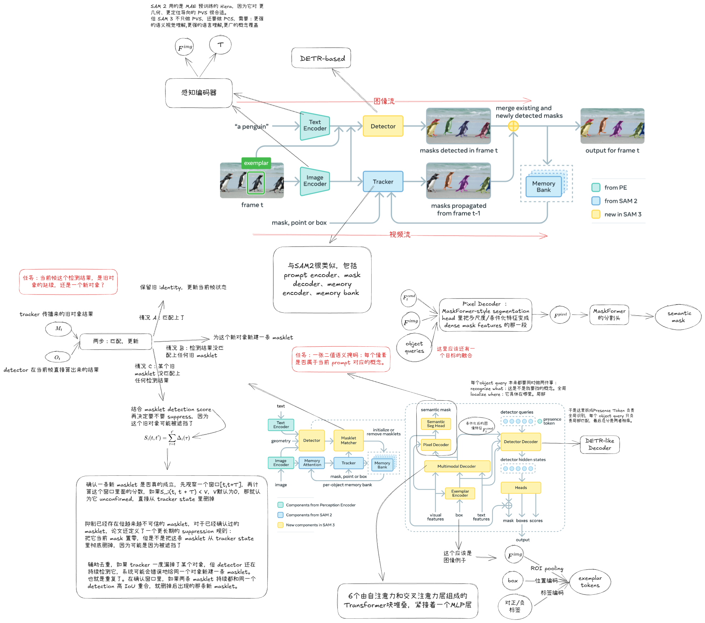
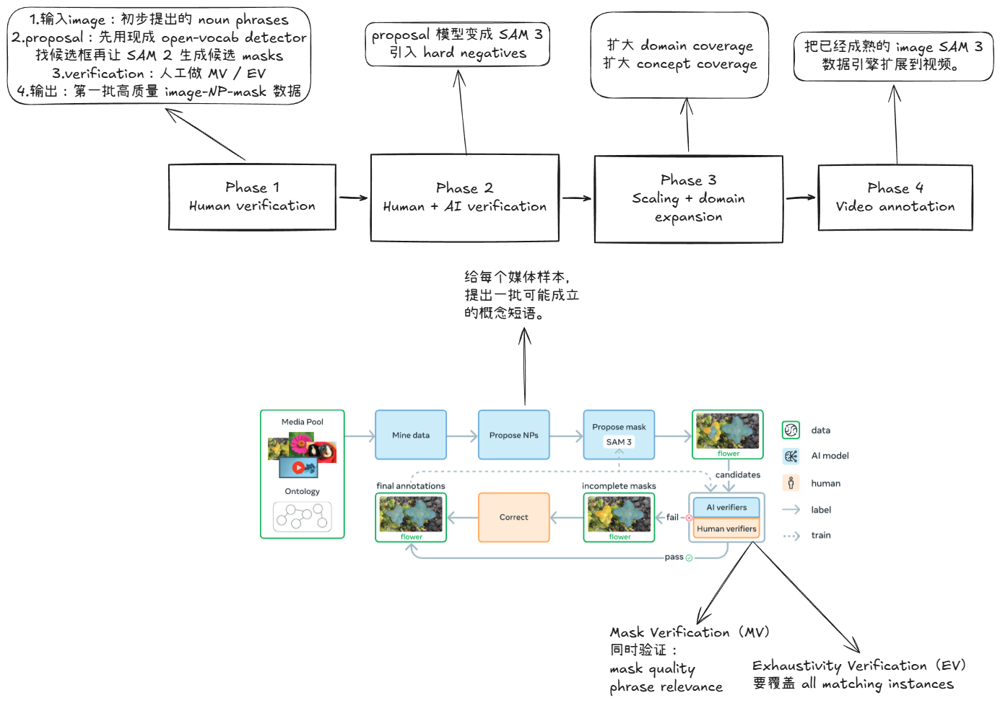
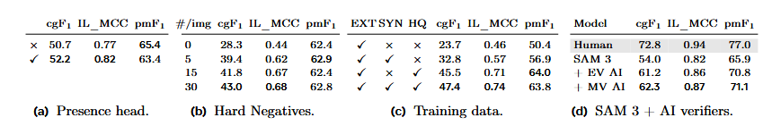
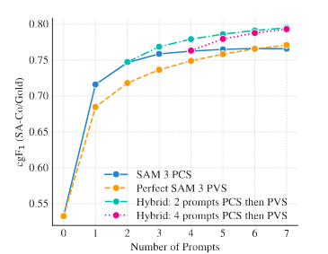

## 1. 任务：SAM 3 相比 SAM 2 到底新增了什么  

### 1.1 SAM 2 的核心任务：PVS  
SAM 2 的主任务是 **Promptable Visual Segmentation (PVS)**：  
  
- 输入：points / boxes / masks 等视觉 prompt  
- 目标：分割一个对象，并在视频中传播这个对象的 masklet  
  
PVS 的核心交互单位是：**单个对象实例**。  
  
### 1.2 SAM 3 的核心新增任务：PCS  
SAM 3 在保留 PVS 的同时，新引入了 **Promptable Concept Segmentation (PCS)**。  
  
PCS 的输入不再只是点、框、mask，而是：  
  
- **短名词短语**（noun phrase），例如 `penguin`、`red apple`、`striped cat`  
- **image exemplars**（正/负样例框）  
- 或两者组合  
  
PCS 的目标是：  
  
- **detect** 所有符合这个概念的实例  
- **segment** 它们  
- 在视频里继续 **track** 它们的 identity  
  
### 1.3 这不是“小升级”，而是任务范式变化  
SAM 2 更像：  
  
> 你告诉我“这个对象”，我把它分出来。  
  
SAM 3 更像：  
  
> 你告诉我“这个概念”，我把所有符合这个概念的实例都找出来、分出来、跟起来。  
  
所以 SAM 3 的难点从“实例级交互分割”扩展到了：  
  
- 开放概念识别  
- 多实例发现  
- 视频 identity 维护  
- 概念歧义处理  
  
---  
  
## 2. SAM 3 总体结构：detector + tracker  

SAM 3 的模型不能再被理解成“一个更强的 SAM 2”。  
  
更准确的理解是：  
  
> **SAM 3 = detector + tracker，共享同一个感知 backbone（PE）**。  
  
- **Detector**：在当前帧里找出所有符合 prompt 概念的实例  
- **Tracker**：把上一时刻已有 identity 的对象传播到当前帧  
- **Matcher / Update**：把“当前帧检测到的实例”和“传播来的旧对象”合并成当前帧最终 masklets  
  
### 2.1  tracker  
tracker 只能传播**旧对象**，不能发现**新对象**。  
  
例子：  
  
- 前几帧已经有 2 只企鹅  
- 第 10 帧又新走进来第 3 只企鹅  
  
tracker 只能继续跟住前两只，**第 3 只必须靠 detector 在当前帧发现**。  
  
所以：  
  
- **tracker 负责延续对象**  
- **detector 负责发现对象**  
  
---  

  
## . Detector 
  
### 3.1 PE vision encoder / PE text encoder  
  
#### 输入  
- vision encoder：当前帧图像  
- text encoder：文本 prompt  
  
#### 作用  
- vision encoder 输出当前帧的视觉特征  
- text encoder 输出文本概念特征  
  
#### 输出  
- `visual features`  
- `text features`  
  
这里还没有发生“图像-文本融合”。  
  
---  
  
### 3.2 Exemplar Encoder  
  
这是本次讨论里最容易讲错的一块。  
  
#### 输入  
Exemplar Encoder 的输入有三类：  
  
1. **visual features**  
2. **box**  
3. **label（positive / negative）**  
  
#### 结构（论文明确给出的 block 级结构）  
对每个 exemplar：  
  
1. 从 visual features 里按 box 取出 **ROI-pooled visual features**  
2. 对 box 做 **position embedding**  
3. 对正/负标签做 **label embedding**  
4. 将三者拼接（concatenate）  
5. 经过一个 **small transformer**，得到 exemplar tokens  
  
#### 输出  
- `exemplar tokens`  
  
#### 关键理解  
Exemplar Encoder 不是在“直接预测 mask”，而是在做：  
  
> 把一个 exemplar 变成模型可用的概念提示 token  
  
所以 exemplar 的本质是：  
  
- 视觉内容  
- 空间位置  
- 正/负语义标签  
  
三者的联合表示。  
  
---  
  
### 3.3 Prompt tokens  
  
#### 输入  
- text features / text tokens  
- exemplar tokens  
  
#### 输出  
- `prompt tokens`  
  
#### 作用  
把“文本概念提示”和“样例概念提示”合成一套统一条件表示。  
  
---  
  
### 3.4 Fusion Encoder  
  
#### 输入  
1. `visual features`  
2. `prompt tokens`  
  
#### 结构  
论文明确写到它由多层 transformer block 组成，每层包含：  
  
- self-attention  
- 对 prompt tokens 的 cross-attention  
- MLP  
  
#### 输出  
- `conditioned frame-embeddings`  
  
#### 作用  
Fusion Encoder 做的不是检测，而是：  
  
> 把“找什么”写进“图像特征”里  
  
换句话说：  
  
- 输入前：visual features 只知道“图里有什么”  
- 输出后：conditioned frame-embeddings 知道“在当前 prompt 条件下，哪些区域更相关”  
  
---  
  
### 3.5 Detector Decoder  
  
#### 输入  
1. `learned object queries`  
2. `presence token`  
3. `prompt tokens`  
4. `conditioned frame-embeddings`  
  
#### 结构  
论文明确说明：  
  
- object queries 先做 self-attention  
- 再 cross-attend 到：  
  - prompt tokens  
  - conditioned frame-embeddings  
- 最后输出 detector hidden states  
  
#### 输出  
- `detector hidden states`  
  
#### 关键理解  
Detector Decoder 不只是“在图上找框”，而是让一组 query 同时参考：  
  
- 现在要找什么概念（prompt tokens）  
- 当前帧在这个概念下的条件化视觉特征（conditioned frame-embeddings）  
  
---  
  
### 3.6 Presence Token 与 Presence Head  
  
这是 detector 里最值得单独记的一组设计。  
  
#### Presence Token 是什么  
- 它是 Detector Decoder 里的一个**特殊可学习 token**  
- 它不负责定位具体实例  
- 它只负责回答：  
  
> 当前这张图 / 当前这一帧里，到底有没有这个概念？  
  
#### Presence Head 是什么  
- 它是接在 presence token hidden state 后面的一个 **MLP classification head**  
- 输出：  
  
$$
p(\text{NP is present in input})
$$
  
#### 为什么要这样设计  
因为 detector 里原本每个 query 都既要做：  
  
- recognition：这是不是这个概念  
- localization：它具体在哪里  
  
这两件事是冲突的：  
  
- recognition 需要全局上下文  
- localization 更偏局部  
  
所以作者把它拆开：  
  
- **Presence Token / Head**：管“整张图里有没有这个概念”  
- **Object queries**：管“具体实例在哪里”  
  
#### 最重要的理解  
Presence head 的主要贡献不是提升 mask 精度，而是提升：  
  
- image-level recognition  
- calibration  
- negative rejection  
  
这在消融里体现得非常明显。  
  
---  
  
## 5. Segmentation Head
  
### 5.1 论文明确说了什么  
论文明确展开的是 **Segmentation Head**，而不是单独逐层解释 `Pixel Decoder`。  
  
作者明确写到：  
  
- segmentation head **adapted from MaskFormer**  
- **semantic segmentation 和 instance segmentation 共用同一条 segmentation head**  
- **semantic segmentation** 使用 Fusion Encoder 输出的 conditioned features  
- **instance segmentation** 还额外使用 Detector Decoder 的 output object queries  
- 因为 vision encoder 是 single-scale ViT，所以用 **SimpleFPN** 提供 multi-scale features  
  
- `Multimodal Decoder`  
- `Pixel Decoder`  
- `Semantic Seg Head`  
  
应当被理解为：  
  
> Figure 10 对 Segmentation Head 内部的图示展开  
  
但论文文字真正精确定义的是：  
  
- Segmentation Head 的功能  
- 它的输入来源  
- semantic / instance segmentation 的分工  
  
而不是单独把 Pixel Decoder 的每层实现完全展开。  
  
### 5.3 semantic 和 instance 的区别  
- **semantic segmentation**：输出“哪些像素属于这个概念”  
- **instance segmentation**：输出“每个具体实例的 mask”  
  
所以：  
  
- semantic 更像概念区域图  
- instance 更像按实例拆开的区域图  
  
---  
  
## 6. Tracker
  
### 6.1 最核心的公式  
  
$$
\hat M_t = \text{propagate}(M_{t-1}),\quad
O_t = \text{detect}(I_t, P),\quad
M_t = \text{match\_and\_update}(\hat M_t, O_t)
$$
  
也就是：  
  
1. 先把旧对象往前传播  
2. 再在当前帧检测  
3. 最后合并  
  
---  
  
### 6.2 Masklet 在 SAM 3 里的准确含义  
在 SAM 3 里，masklet 不能只理解成“连续 mask 序列”。  
  
更准确地说，masklet 是：  
  
> 一个带 identity、带时序记忆、会在每一帧被更新的对象状态单元  
  
它至少包含：  
  
- 这个对象是谁（identity）  
- 当前帧的 mask  
- 过去的 appearance / memory  
- 最近是否持续被 detector 支持  
  
---  
  
### 6.3 Tracker 的输入  
Tracker 在时刻 $t$ 的输入有三类：  
  
1. 上一时刻已有 masklets：$M_{t-1}$  
2. 当前帧图像特征  
3. memory bank  
  
### 6.4 Tracker 的结构  
正文明确说，它是 **SAM 2 style propagation**，也就是：  
  
- prompt encoder  
- mask decoder  
- memory encoder  
- memory bank  
  
这一点和 SAM 2 一脉相承。  
  
### 6.5 Tracker 的输出  
传播结果记作：  
  
$$
\hat M_t
$$
  
表示旧对象在当前帧的预测位置与 mask。  
  
---  
  
## 7. Masklet Matcher  
  
这一步不是“把两个 mask 直接相加”。  
  
### 7.1 输入  
- tracker 传播结果：$\hat M_t$  
- detector 当前帧结果：$O_t$  
  
### 7.2 结构  
正文明确说：  
  
> 通过一个 **simple IoU based matching function** 把两者匹配起来  
  
### 7.3 它具体做什么  
#### 情况 A：匹配上了  
- 当前 detection 被判定为某个旧对象的延续  
- 保留旧 identity  
- 更新当前帧状态  
  
#### 情况 B：某个 detection 没匹配上任何旧对象  
- 这是新对象  
- **spawn new masklet**  
  
#### 情况 C：某个旧对象没匹配上 detection  
- 先不立刻删  
- 后面再交给 MDS 决定是否 suppress  
  
### 7.4 输出  
- 当前帧最终 masklets：$M_t$  
  
### 7.5 一句话  
> Masklet Matcher 做的是对象级匹配更新，不是像素级直接并集。  
  
---  
  
## 8. Masklet Detection Score（MDS）  
  
这是 SAM 3 视频线路里非常关键的补丁机制。  
  
### 8.1 它是什么  
> **MDS 是一条 masklet 在一段时间内“有没有持续被 detector 支持”的累积分数。**  
  
它不是网络 head 学出来的，而是论文手工定义的时间统计量。  
  
### 8.2 逐帧匹配函数  
对第 $i$ 条 masklet 在第 $\tau$ 帧：  
  
- 如果它和某个 detection 的 IoU 超过阈值：记 **+1**  
- 否则：记 **-1**  
  
### 8.3 区间分数  
在时间区间 $[t, t']$ 上，把这些逐帧 +1 / -1 累加起来：  
  
$$
S_i(t,t')=\sum_{\tau=t}^{t'} \Delta_i(\tau)
$$
  
### 8.4 它解决什么问题  
MDS 不是“检测新对象”，而是：  
  
> **判断一条 masklet 在时间上是不是持续被 detector 认可。**  
  
### 8.5 它的三种用途  
1. **确认新生 masklet** 是否是真的，而不是短暂假阳性  
2. **抑制长期不再被 detector 支持的漂移 masklet**  
3. **辅助去重**（避免同一个对象被错误生成两条 masklet）  
  
### 8.6 最关键理解  
- Matcher：解决“这一帧怎么配对”  
- MDS：解决“这条 track 长期靠不靠谱”  
  
---  
  
## 9. Detection-guided re-prompting  
  
这是 SAM 3 右半边第二个关键补丁。  
  
### 9.1 作用  
周期性地用 **高置信 detector masks** 去重新给 tracker 做 prompt，纠正 tracker 漂移。  
  
### 9.2 为什么必要  
tracker 的误差会累积：  
  
- 一旦跟偏  
- memory bank 里也会继续存偏掉的参考  
- 越往后越难恢复  
  
所以 detector 会反过来“纠偏” tracker。  
  
### 9.3 一句话  
> detector 不只是发现新对象，也在帮助 tracker 重新对准旧对象。  
  
---  
  
## 10. 数据部分：

### 10.1 Figure 5 
Figure 5 画的是：  
  
> 从媒体池和 ontology 出发，先提 noun phrases，再提候选 masks，然后做 verification + correction，最后形成高质量训练数据并回流训练 SAM 3 的闭环。  
  
最关键的不是 proposal，而是：  
  
- **Mask Verification (MV)**：mask 对不对，和 phrase 匹不匹配  
- **Exhaustivity Verification (EV)**：这个 phrase 的所有实例是不是都被覆盖了  
  
所以 SAM 3 的数据不是“有一些 mask 就够”，而是要保证：  
  
- 概念对  
- mask 对  
- 实例全  
  
---  
  
### 10.2 四个 phase 的本质升级  
#### Phase 1：Human Verification  
- 冷启动  
- 人类做 MV / EV  
- 得到第一批高质量 image-NP-mask 数据  
  
#### Phase 2：Human + AI Verification  
- AI verifier 上线  
- AI 先筛，人工兜底  
- 开始引入 hard negatives  
- 吞吐量大增  
  
#### Phase 3：Scaling + Domain Expansion  
- 扩大 domain coverage  
- 扩大 concept coverage  
- 引入更多长尾概念和 harder negatives  
- 持续迭代 SAM 3 和 AI verifiers  
  
#### Phase 4：Video Annotation  
- 把 image PCS 扩展到 video PCS  
- 开始构建 SA-Co/VIDEO  
  
### 10.3 最关键理解  
SAM 3 的数据引擎不是“越采越多”，而是：  
  
> **越采越自动、越采越广、越采越难，最后扩到视频。**  
  
---  
  
## 11. 实验

1. **Table 9：模块/数据消融**  
2. **Figure 7：PCS exemplar interaction vs PVS refinement**  
  
---  
  
### 11.1 Presence head 的作用  

消融表明：  
  
- presence head 带来的主要提升体现在 **IL_MCC**  
- 对 pmF1 的提升并不大  
  
说明：  
  
> Presence head 主要提升的是 image-level recognition / calibration，而不是局部 mask 边界本身。  
  
---  
  
### 11.2 Hard negatives 的作用  
消融表明：  
  
- hard negatives 数量增加后，**IL_MCC 明显提升**  
- pmF1 变化不大  
  
说明：  
  
> hard negatives 主要提升的是“这个概念算不算”的判别能力，而不是 mask 精度。  
  
---  
  
### 11.3 HQ 与 SYN 数据的作用  
消融表明：  
  
- HQ 数据贡献最大  
- SYN 数据也确实有效  
- HQ 和 SYN 是互补关系，不是替代关系  
  
所以：  
  
> HQ 负责把方向拉正，SYN 负责把规模和新域推开。  
  
---  
  
### 11.4 AI verifiers 的作用  
AI verifiers 不只是提速工具。消融表明：  
  
- EV AI verifier 带来显著增益  
- MV AI verifier 进一步带来额外增益  
  
说明：  
  
> AI verifiers 会直接改善 pseudo-label 质量，从而改善最终模型。  
  
---  
  
### 11.5 Figure 7 的关键结论  

这张图证明：  
  
- exemplar-based PCS 更擅长“概念级修正”  
- PVS refinement 更擅长“实例级精修”  
- 两者互补  
  
所以 image exemplar 不是“再加一种 prompt”，而是改变了交互范式。  
  

